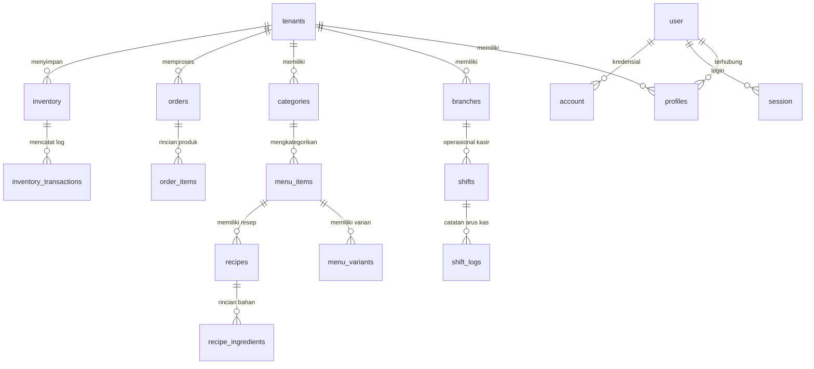

# 🗄️ Dokumentasi Schema Database Neon Postgres - Taj SaaS

Dokumen resmi ini menjelaskan struktur, fungsi, dan relasi seluruh tabel pada database **Neon Serverless Postgres** yang digunakan oleh platform **Taj SaaS** (`packages/db/schema.ts`).

---

## 📑 Daftar Isi
1. [Ringkasan Arsitektur Database](#1-ringkasan-arsitektur-database)
2. [Kelompok 1: Tabel Otentikasi (Better Auth Core)](#2-kelompok-1-tabel-otentikasi-better-auth-core)
3. [Kelompok 2: Tabel Multi-Tenant & Organisasi Bisnis](#3-kelompok-2-tabel-multi-tenant--organisasi-bisnis)
4. [Kelompok 3: Tabel Produk, Resep, & Inventori F&B](#4-kelompok-3-tabel-produk-resep--inventori-fb)
5. [Kelompok 4: Tabel Transaksi, Kasir POS, & Shift](#5-kelompok-4-tabel-transaksi-kasir-pos--shift)
6. [Kelompok 5: Tabel Log, Promosi, & Persetujuan](#6-kelompok-5-tabel-log-promosi--persetujuan)
7. [Diagram Relasi Antar Tabel (ERD)](#7-diagram-relasi-antar-tabel-erd)

---

## 1. Ringkasan Arsitektur Database

Database Taj SaaS dirancang dengan pola **Multi-Tenant Data Isolation**. Seluruh tabel bisnis memiliki kolom `tenant_id` yang terindeks (`tenantId_idx`) untuk menjamin bahwa data milik Tenant A **terisolasi secara aman** dari Tenant B.

- **DBMS:** Neon Serverless Postgres
- **ORM:** Drizzle ORM (`@taj-saas/db`)
- **Total Tabel:** 23 Tabel Utama

---

## 2. Kelompok 1: Tabel Otentikasi (Better Auth Core)

Tabel-tabel ini digunakan oleh engine otentikasi **Better Auth** untuk menangani login, pendaftaran, dan manajemen sesi pengguna.

### 1. `user`
* **Fungsi:** Menyimpan data identitas dasar setiap pengguna terdaftar di sistem.
* **Kolom Kunci:**
  * `id` (VARCHAR 36 - Primary Key): Unique User ID.
  * `name` (VARCHAR 255): Nama lengkap pengguna.
  * `email` (VARCHAR 255): Email pengguna (Unik).
  * `emailVerified` (BOOLEAN): Status verifikasi email.

### 2. `session`
* **Fungsi:** Menyimpan token sesi login pengguna yang sedang aktif di browser.
* **Kolom Kunci:**
  * `id` (VARCHAR 36): Session ID.
  * `userId` (Foreign Key $\rightarrow$ `user.id`): ID pengguna pemilik sesi.
  * `token` (VARCHAR 255): Token sesi terenkripsi.
  * `expiresAt` (TIMESTAMP): Waktu kadaluarsa sesi.
  * `ipAddress` & `userAgent`: Informasi perangkat pengguna.

### 3. `account`
* **Fungsi:** Menyimpan kredensial kata sandi dan provider otentikasi pengguna (Credential / OAuth).
* **Kolom Kunci:**
  * `userId` (Foreign Key $\rightarrow$ `user.id`): ID pengguna.
  * `providerId` (TEXT): Provider auth (misal: `'credential'`).
  * `password` (TEXT): Hash kata sandi terenkripsi (BCrypt).

### 4. `verification`
* **Fungsi:** Menyimpan token sementara untuk verifikasi email atau reset kata sandi.

---

## 3. Kelompok 2: Tabel Multi-Tenant & Organisasi Bisnis

### 5. `tenants`
* **Fungsi:** Menyimpan data profil utama penyewa/pemilik bisnis F&B (Tenant).
* **Kolom Kunci:**
  * `id` (UUID - Primary Key): Unique Tenant ID.
  * `name` (TEXT): Nama entitas bisnis (misal: *"Martabak A6 Nyuss"*).
  * `slug` (TEXT - Unik): Slug penjelajah URL (misal: `taj-saas`).
  * `domain` (TEXT - Unik): Domain kustom bisnis (misal: `a6nyuss.com`).
  * `branding` (JSONB): Pengaturan warna tema, logo toko, alamat, dan tarif ongkir flat.
  * `storeSettings` (JSONB): Pengaturan operasional toko (status buka/tutup `is_open`).

### 6. `profiles`
* **Fungsi:** Menghubungkan ID pengguna (`user.id`) dengan `tenant_id` dan menentukan Hak Akses / Role.
* **Kolom Kunci:**
  * `id` (Foreign Key $\rightarrow$ `user.id`): ID pengguna.
  * `tenantId` (Foreign Key $\rightarrow$ `tenants.id`): Tenant tempat pengguna bekerja.
  * `role` (TEXT): Peran pengguna (`'owner'`, `'manager'`, `'kasir'`).
  * `status` (TEXT): Status akun (`'active'`, `'inactive'`).

### 7. `branches`
* **Fungsi:** Menyimpan daftar gerai/outlet/cabang fisik yang dimiliki oleh tenant.
* **Kolom Kunci:**
  * `id` (UUID): Branch ID.
  * `tenantId` (Foreign Key $\rightarrow$ `tenants.id`): Tenant pemilik cabang.
  * `name` (TEXT): Nama cabang (misal: *"Cabang Demak"*, *"Cabang Pasar Kembang"*).
  * `address` & `phone`: Alamat & nomor telepon outlet.
  * `picName` (TEXT): Nama penanggung jawab cabang (PIC).

---

## 4. Kelompok 3: Tabel Produk, Resep, & Inventori F&B

### 8. `categories`
* **Fungsi:** Menyimpan pengelompokan kategori menu produk.
* **Contoh Data:** Martabak Manis, Martabak Telur, Minuman.

### 9. `menu_items`
* **Fungsi:** Menyimpan daftar produk makanan dan minuman yang dijual.
* **Kolom Kunci:**
  * `id` (UUID): Menu Item ID.
  * `tenantId` & `categoryId`: Relasi tenant & kategori.
  * `name` & `slug`: Nama menu & slug URL.
  * `price` (NUMERIC 10,2): Harga jual dasar produk.
  * `isAvailable` (BOOLEAN): Status stok ketersediaan menu di kasir & web.
  * `badge` (TEXT): Sematan khusus (`'Best Seller'`, `'New'`).

### 10. `menu_variants`
* **Fungsi:** Menyimpan opsi pilihan varian menu (misal: Ukuran Loyang Besar/Sedang, Tingkat Kepedasan) beserta penambahan harga (*price modifier*).

### 11. `toppings`
* **Fungsi:** Menyimpan opsi topping ekstra (misal: Keju Melt +Rp5.000, Extra Cokelat +Rp3.000).

### 12. `recipes` (Header Resep / BOM)
* **Fungsi:** Identitas utama kartu resep (Bill of Materials) yang mengaitkan satu menu produk dengan takaran bahan bakunya.

### 13. `recipe_ingredients` (Detail Bahan Resep)
* **Fungsi:** Menyimpan rincian komposisi bahan baku beserta takarannya per porsi pesanan.
* **Kolom Kunci:**
  * `recipeId` (Foreign Key $\rightarrow$ `recipes.id`): Resep induk.
  * `ingredientName` (TEXT): Nama bahan baku.
  * `quantity` (NUMERIC): Jumlah takaran (misal: `0.15`).
  * `unit` (TEXT): Satuan takaran (`'kg'`, `'gram'`, `'pcs'`, `'liter'`).

### 14. `inventory`
* **Fungsi:** Menyimpan data stok bahan baku aktual yang tersimpan di gudang/outlet.
* **Kolom Kunci:** `stock`, `unit`, `minStock` (batas peringatan stok tipis), `costPerUnit` (harga beli modal).

### 15. `inventory_transactions`
* **Fungsi:** Rekam jejak transaksi keluar/masuk bahan baku (pembelian stok masuk, pemakaian produksi, barang rongsok/expired).

---

## 5. Kelompok 4: Tabel Transaksi, Kasir POS, & Shift

### 16. `orders`
* **Fungsi:** Tabel utama yang menyimpan data setiap pesanan pelanggan.
* **Kolom Kunci:**
  * `id` (UUID): Order ID.
  * `orderCode` (TEXT - Unik): Kode unik pesanan pelanggan (misal: `A6-20260729-1024`).
  * `customerName` & `customerPhone`: Identitas pemesan.
  * `deliveryType` (TEXT): Tipe pemesanan (`'pickup'` / `'delivery'`).
  * `subtotal` & `totalPrice` (NUMERIC): Total biaya belanja.
  * `status` (TEXT): Tahapan pesanan (`'received'`, `'processing'`, `'ready'`, `'completed'`, `'cancelled'`).
  * `paymentMethod` (`'cod'`, `'qris'`) & `paymentStatus` (`'pending'`, `'paid'`).

### 17. `order_items`
* **Fungsi:** Menyimpan rincian setiap produk yang dibeli di dalam satu pesanan.
* **Kolom Kunci:** `orderId`, `menuItemName`, `variantName`, `quantity`, `unitPrice`, `totalPrice`.

### 18. `shifts`
* **Fungsi:** Menyimpan riwayat shift operasional kasir di setiap cabang.
* **Kolom Kunci:**
  * `startingCash`: Modal uang tunai awal di laci kasir.
  * `actualCash`: Fisik uang tunai hasil penghitungan saat tutup kasir.
  * `drift`: Selisih uang kas laci (Selisih = Actual Cash - Expected Cash).
  * `status`: Status shift (`'open'`, `'closed'`).

### 19. `shift_logs`
* **Fungsi:** Menyimpan catatan arus kas transaksi uang masuk (*cash_in*) atau uang keluar (*cash_out*) selama shift berjalan.

---

## 6. Kelompok 5: Tabel Log, Promosi, & Persetujuan

### 20. `audit_logs`
* **Fungsi:** Rekam jejak aktivitas penting pengguna sistem (siapa yang mengubah status order, membuka gerai, memverifikasi pembayaran).

### 21. `promos`
* **Fungsi:** Menyimpan kode kupon diskon promo (tipe `fixed`/`percent`, minimal order, batas tanggal berlaku).

### 22. `files`
* **Fungsi:** Menyimpan lampiran file gambar (seperti screenshot bukti transfer bayar QRIS) dalam format data base64.

### 23. `approvals`
* **Fungsi:** Pengajuan persetujuan pengeluaran dana/refund dari kasir/manajer yang memerlukan konfirmasi Pemilik Bisnis (Owner).

---

## 7. Diagram Relasi Antar Tabel (ERD)

---
*Dokumen ini merupakan panduan resmi struktur database Taj SaaS.*
