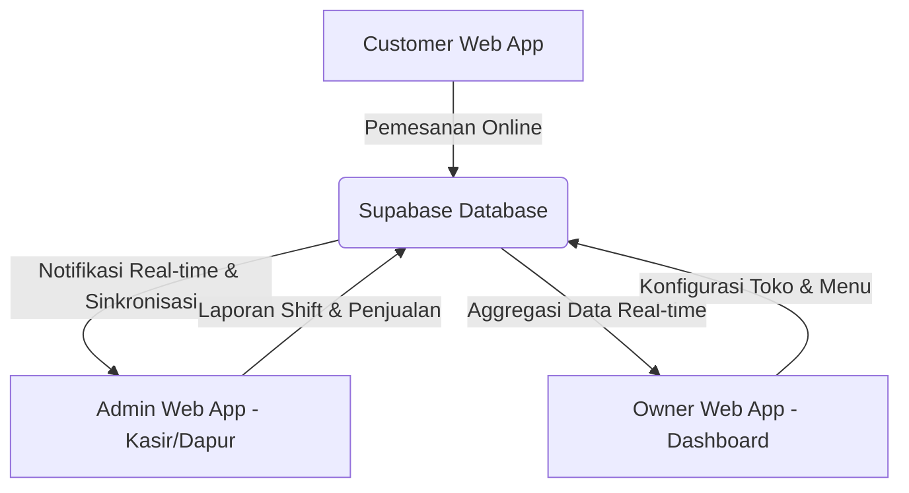

# Laporan Analisis Mendalam: UI/UX & Fitur Aplikasi (TajDigital F&B SaaS)

Dokumen ini menyajikan analisis rinci mengenai antarmuka pengguna (UI), pengalaman pengguna (UX), dan rangkaian fitur dari tiga aplikasi utama dalam ekosistem **TajDigital F&B SaaS**:
1. **Customer Web App** (Portal Pelanggan untuk pemesanan online)
2. **Admin Web App** (Portal Kasir & Dapur Operasional)
3. **Owner Web App** (Dashboard Eksekutif & Analitik Bisnis)

---

## Ringkasan Ekosistem Aplikasi

Ekosistem aplikasi ini dirancang sebagai platform SaaS multi-tenant untuk bisnis F&B (saat ini digunakan oleh *Martabak Terbul taj_saas* untuk portal customer, dan *Martabak Mas Bambang* untuk analitik owner). Hubungan antar aplikasi dapat digambarkan dalam diagram alir berikut:

---

## 1. Customer Web App (Portal Pelanggan)

Aplikasi berbasis Next.js ini berfungsi sebagai menu digital interaktif dan platform pemesanan langsung (*Direct-to-Consumer*) tanpa komisi pihak ketiga.

### A. Desain UI/UX & Estetika
* **Tema Visual**: Premium & Energik. Menggunakan gradasi warna merah-oranye hangat (`#8E0E0E` ke `#E05009`) yang disesuaikan untuk merangsang nafsu makan pelanggan (psikologi warna F&B).
* **Responsivitas**: Responsif penuh (Mobile-first). Hero section menggunakan banner versi desktop (`banner_red.png`) dan versi mobile (`banner_redm.png`) secara dinamis.
* **Elemen Interaktif**:
  * **Asisten AI Chatbot (TajAI)**: Widget mengambang (*floating widget*) yang dapat digeser (*drag*) oleh pengguna ke 4 sudut layar dengan efek pegas (*spring animations*) menggunakan `framer-motion`. Pada perangkat mobile, widget otomatis berubah menjadi modal/bottom-sheet agar tidak terpotong layar.
  * **Brand Badge Strip**: Menampilkan sertifikat Halal, rating bintang, durasi pickup/delivery, dan kota asal dalam bentuk bar horizontal bergulir.

### B. Fitur-Fitur Utama (Features)
1. **Katalog Menu Digital**:
   * Menampilkan menu dengan filter kategori (Martabak, Terang Bulan, Minuman, dll.).
   * Menampilkan badge penanda seperti "Terlaris" atau "Promo".
   * Pencarian menu secara langsung (*client-side search*).
2. **Sistem Keranjang & Kustomisasi Produk**:
   * Pemilihan detail varian rasa dan topping tambahan (misalnya: tambah keju, meses, adonan pandan).
   * Perhitungan harga dinamis berdasarkan opsi yang dipilih secara real-time.
3. **Checkout Fleksibel**:
   * Metode **Delivery** (Pengiriman flat-rate Rp 10.000 dengan peta Google Maps interaktif) atau **Pickup** (Ambil sendiri di toko).
   * Validasi kode promo secara instan melalui API (`/api/validate-promo`).
4. **Integrasi WhatsApp**:
   * Link pesan langsung ke nomor WhatsApp toko (`wa.me`) dengan pesan otomatis yang terisi otomatis berdasarkan isi keranjang belanja.
5. **AI Assistant Chatbot**:
   * Terintegrasi dengan model **Gemini AI** (`/api/chat`) untuk melayani pertanyaan pelanggan seputar menu, jam buka, rekomendasi, dan tata cara pemesanan.

---

## 2. Admin Web App (Portal Kasir & Dapur)

Aplikasi operasional ini dirancang khusus untuk staf kasir dan kru dapur dengan fokus pada kecepatan pemrosesan data dan stabilitas koneksi.

### A. Desain UI/UX & Estetika
* **Tema Visual**: *Dark Mode* kontras tinggi (`bg-stone-900` dan `text-stone-100`). Sangat ideal untuk lingkungan dapur yang minim cahaya dan mengurangi ketegangan mata kru operasional yang bekerja berjam-jam.
* **Layout Efisien**:
  * **Split-View Desktop**: Sisi kiri (40% lebar layar) berisi antrean kartu pesanan (*Order Queue*), sisi kanan (60%) berisi detail pesanan yang dipilih beserta opsi tindakan (*Order Detail*).
  * **Slide-over Mobile**: Pada layar HP, daftar antrean dan detail disajikan bergantian dengan animasi geser kiri/kanan agar navigasi satu tangan tetap mudah.
* **Umpan Balik Visual & Audio**:
  * **Buzzer Audio (Beeper)**: Memanfaatkan `AudioContext` web API untuk membunyikan alarm bip saat ada pesanan baru tanpa membutuhkan file audio eksternal (terdapat tombol bisu suara).
  * **Pulse Border & Flash Banner**: Animasi berdenyut untuk menyorot pesanan baru yang belum diproses.

### B. Fitur-Fitur Utama (Features)
1. **Manajemen Antrean Pesanan (Real-time)**:
   * Sinkronisasi data tanpa muat ulang halaman (*real-time database listeners*) untuk mendeteksi pesanan baru yang masuk dari Customer Web App.
   * Filter antrean berdasarkan status: *Menunggu Verifikasi*, *Diproses*, *Siap Diambil*, *Selesai*, dan *Dibatalkan*.
2. **Sistem Shift Kasir**:
   * Tombol Buka/Tutup Shift operasional.
   * Pencatatan saldo kas awal (*starting cash*), pencatatan transaksi manual, dan kalkulasi otomatis saldo kas akhir saat shift ditutup.
   * Log aktivitas toko secara real-time.
3. **Pemantau Koneksi Internet (Network Offline Warning)**:
   * Banner peringatan darurat berwarna merah berdenyut apabila koneksi internet terputus, guna mencegah kasir tidak mengetahui adanya pesanan baru yang tertunda di server.
4. **Dukungan Cetak Struk Fisik (Thermal Print Layout)**:
   * CSS khusus `@media print` untuk mencetak struk belanja ke printer thermal ukuran **80mm** (standar kasir). Layout disesuaikan dengan jenis font monospaced dan struktur ringkas.
5. **Kontrol Ketersediaan Produk**:
   * Kasir dapat mematikan (*toggle*) menu atau topping tertentu jika bahan baku di dapur sedang habis, yang akan langsung menyembunyikan item tersebut di portal Customer.

---

## 3. Owner Web App (Executive Cockpit)

Dashboard eksekutif multi-tenant yang menyajikan visualisasi data tingkat tinggi untuk memantau performa bisnis di semua cabang.

### A. Desain UI/UX & Estetika
* **Tema Visual**: Bersih, profesional, dan modern. Dominasi warna abu-abu terang dan gelap (`slate`) dengan aksen warna primer jingga (`#f97316`) yang melambangkan identitas brand.
* **Visualisasi Data Interaktif**: Menggunakan library grafik **Recharts** untuk visualisasi interaktif (tooltip kustom, area chart, bar chart, scatter chart, dan pie chart).
* **Navigasi Multi-Modul**: Sidebar navigasi yang ramping untuk beralih antar 10 area manajemen bisnis secara instan.

### B. Fitur-Fitur Utama (Features)
1. **Executive Cockpit (Ringkasan Performa)**:
   * Ringkasan KPI: Omzet, Jumlah Order, Rata-rata Nilai Order (AOV), dan Keuntungan Bersih.
   * Grafik tren pendapatan harian yang dapat difilter per 7 hari, 30 hari, atau 90 hari terakhir.
   * *Hourly Sales Heatmap*: Tabel visual intensitas transaksi per jam per hari untuk membantu owner memetakan jam-jam tersibuk (*rush hours*).
2. **AI Insights & Forecasting (TajAI)**:
   * **TajAI Chat**: Chatbot asisten bisnis interaktif berbasis AI untuk menjawab pertanyaan pemilik seputar laporan keuangan, penyebab inefisiensi, dan tren stok.
   * **Financial Simulator**: Slider interaktif untuk mensimulasikan persentase kenaikan harga, pengurangan biaya bahan baku, atau perubahan volume penjualan, lalu menghitung estimasi profit secara dinamis.
   * **Demand Forecasting**: Grafik proyeksi penjualan di masa depan berdasarkan tren data historis.
3. **Analisis Menu & Resep (Menu Engineering)**:
   * **Analisis Kuadran BCG**: Scatter chart interaktif yang memetakan menu ke dalam 4 kategori strategis:
     * **Star** (Penjualan tinggi, Margin tinggi)
     * **Plow-Horse** (Penjualan tinggi, Margin rendah)
     * **Puzzle** (Penjualan rendah, Margin tinggi)
     * **Dog** (Penjualan rendah, Margin rendah)
   * **Bill of Materials (BOM)**: Rincian kebutuhan bahan baku per porsi menu beserta biaya produksi (*COGS*) untuk melacak margin profit secara akurat.
4. **Modul Keuangan (Finance)**:
   * Laporan Profit & Loss (P&L) bulanan.
   * Perbandingan Arus Kas masuk (*Inflow*) vs keluar (*Outflow*).
   * Laporan rekonsiliasi shift kasir untuk melacak selisih uang di laci kasir (*expected cash vs actual cash*).
5. **Modul Persediaan & Waste (Inventory)**:
   * Pemantauan stok bahan baku dengan penanda otomatis untuk stok yang **Kritis** atau **Rendah**.
   * Sistem waste logging (pencatatan bahan terbuang) berdasarkan alasan (basi, gosong, rusak) beserta total kerugian finansial yang diakibatkan.
6. **Modul SDM & Shift (Labor Management)**:
   * Direktori karyawan lengkap dengan peran (Kasir, Produksi, Pelayan), shift kerja, dan gaji bulanan.
   * Analisis persentase biaya tenaga kerja (*labor cost*) per cabang dibandingkan dengan batas target aman perusahaan (rata-rata 18%).
7. **Modul Manajemen Cabang (Branches)**:
   * Pemantauan multi-cabang secara terpusat.
   * Pengisian form tambah cabang baru yang terhubung ke database server action tenant.

---

## Ringkasan Perbandingan Fitur & UI/UX

| Aspek | Customer Web App | Admin Web App | Owner Web App |
| :--- | :--- | :--- | :--- |
| **Tujuan Utama** | Pemesanan mandiri & Katalog | Operasional harian & Kasir | Analitik bisnis & Pengambilan keputusan |
| **Basis Pengguna** | Pelanggan Umum | Staf Kasir & Kru Dapur | Pemilik Bisnis (Owner / Eksekutif) |
| **Tema UI** | Terang/Premium (Merah-Oranye) | Gelap / Kontras Tinggi (Stone-Dark) | Bersih & Terang (Slate-Orange) |
| **Karakter UX** | Visual menarik, animasi interaktif | Cepat, responsif, minim loading, audio alert | Informatif, visualisasi chart, analitik AI |
| **Teknologi Utama** | Next.js, Zustand (`cartStore`), Gemini | Next.js, Zustand (`adminStore`), Web Audio | Next.js, Drizzle ORM, Recharts, TajAI |
