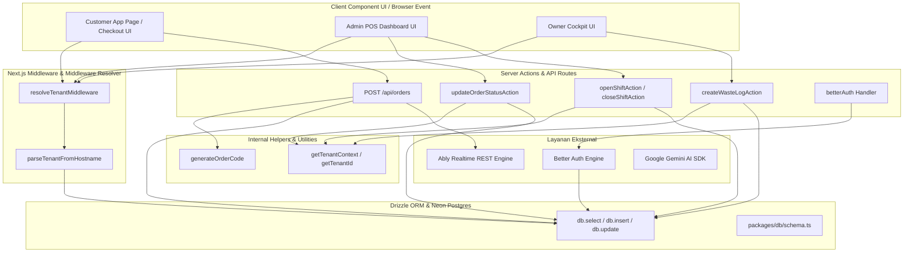
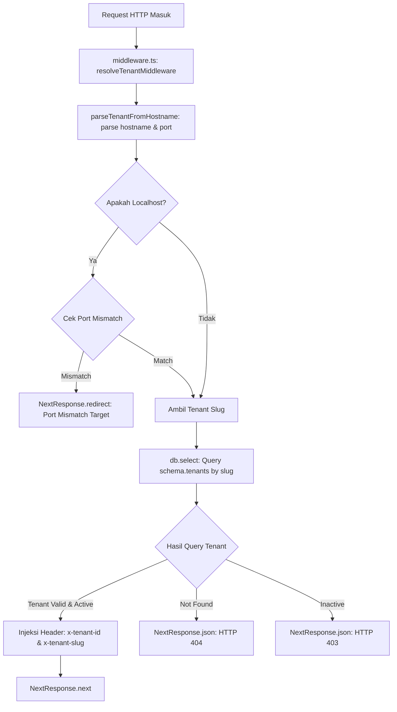
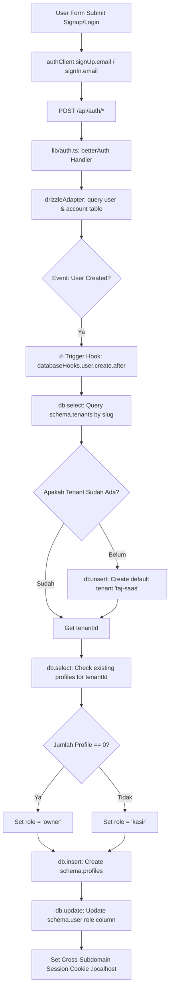
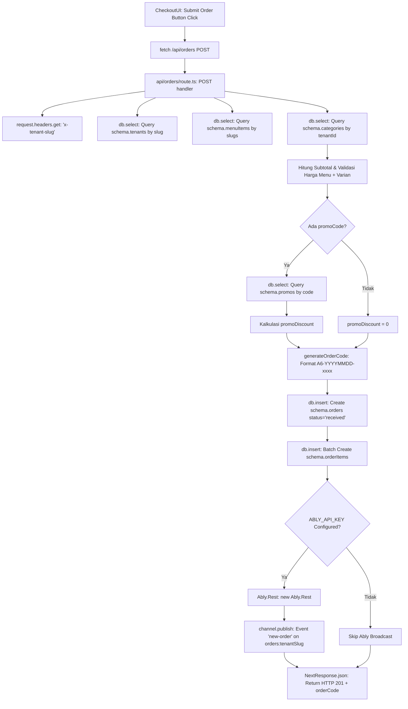
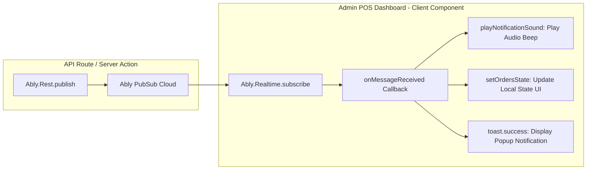
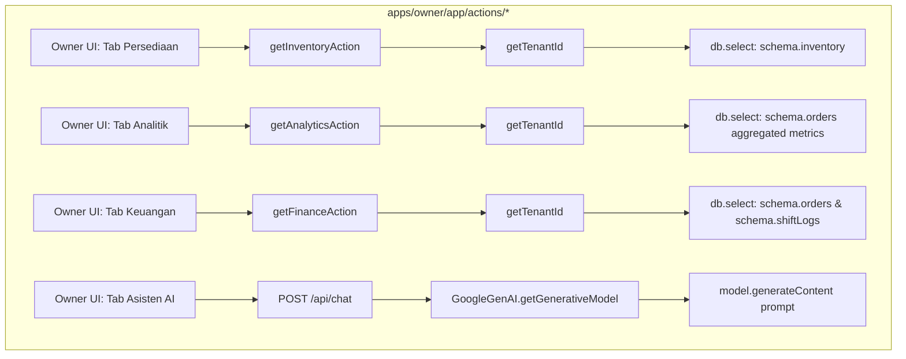

# 📞 Dokumentasi Call Graph Complete - Taj SaaS Platform

Dokumen ini berisi **Call Graph (Grafik Panggilan Fungsi & Hierarki Eksekusi)** lengkap untuk sistem **Taj SaaS (Enterprise Multi-Tenant F&B SaaS Platform)**. 

Call Graph ini memetakan hubungan keterpanggilan (*caller-to-callee*) dari titik masuk (*entry point*) di lapisan UI (Client Component / Browser Event), ke lapisan Server Action & API Route Handler, helper internal, ORM Drizzle Postgres, hingga layanan eksternal (Ably Realtime, Better Auth, & Google Gemini AI).

---

## 📑 Daftar Isi Call Graph
1. [Hierarki Panggilan Arsitektur Monorepo Overview](#1-hierarki-panggilan-arsitektur-monorepo-overview)
2. [Call Graph 1: Resolusi Tenant & Middleware Interceptor](#2-call-graph-1-resolusi-tenant--middleware-interceptor)
3. [Call Graph 2: Otentikasi & Database Hook Pendaftaran User](#3-call-graph-2-otentikasi--database-hook-pendaftaran-user)
4. [Call Graph 3: Pembuatan Pesanan Pelanggan (Customer Checkout Flow)](#4-call-graph-3-pembuatan-pesanan-pelanggan-customer-checkout-flow)
5. [Call Graph 4: Notifikasi Broadcast Pesanan Real-time (Ably PubSub)](#5-call-graph-4-notifikasi-broadcast-pesanan-real-time-ably-pubsub)
6. [Call Graph 5: Operasional Kasir & Management Shift POS](#6-call-graph-5-operasional-kasir--management-shift-pos)
7. [Call Graph 6: Executive Cockpit & Server Actions Owner](#7-call-graph-6-executive-cockpit--server-actions-owner)
8. [Call Graph 7: Manajemen Inventori & Waste Logging (Resep BOM)](#8-call-graph-7-manajemen-inventori--waste-logging-resep-bom)
9. [Matriks Matriks Trace Panggilan Fungsi (Full Call Matrix Table)](#9-matriks-trace-panggilan-fungsi-full-call-matrix-table)

---

## 1. Hierarki Panggilan Arsitektur Monorepo Overview

Diagram berikut memperlihatkan peta hubungan panggilan fungsi umum dari UI Client Component hingga ke Database & External Services.



---

## 2. Call Graph 1: Resolusi Tenant & Middleware Interceptor

Memetakan eksekusi saat HTTP Request pertama kali menyentuh server Next.js.



---

## 3. Call Graph 2: Otentikasi & Database Hook Pendaftaran User

Memetakan panggilan fungsi saat pengguna mendaftar atau login melalui **Better Auth Engine**.



---

## 4. Call Graph 3: Pembuatan Pesanan Pelanggan (Customer Checkout Flow)

Memetakan urutan panggilan dari tombol submit pesanan di UI Pelanggan hingga insert data pesanan & broadcast event.



---

## 5. Call Graph 4: Notifikasi Broadcast Pesanan Real-time (Ably PubSub)

Memetakan panggilan jaringan asinkron dari server pembawa event ke UI Kasir.



---

## 6. Call Graph 5: Operasional Kasir & Management Shift POS

Memetakan panggilan Server Actions yang dieksekusi oleh kasir di aplikasi POS (`apps/admin`).

```mermaid
flowchart TD
    subgraph Shift_Management [Manajemen Shift Kasir]
        A1[POS UI: Tombol Buka Shift] --> A2[openShiftAction startingCash, operatorName]
        A2 --> A3[getTenantContext]
        A3 --> A4[db.select: Check open shifts]
        A4 --> A5[db.insert: schema.shifts status='open']
        A5 --> A6[db.insert: schema.shiftLogs action='open']
        A6 --> A7[revalidatePath /]

        B1[POS UI: Tombol Tutup Shift] --> B2[closeShiftAction shiftId, actualCash, expectedCash]
        B2 --> B3[getTenantContext]
        B3 --> B4[db.update: schema.shifts status='closed', drift]
        B4 --> B5[db.insert: schema.shiftLogs action='close']
        B5 --> B6[revalidatePath /]
    end

    subgraph Order_Operations [Operasional Pesanan POS]
        C1[POS UI: Ubah Status Order] --> C2[updateOrderStatusAction orderId, newStatus]
        C2 --> C3[getTenantContext]
        C3 --> C4[db.update: schema.orders status]
        C4 --> C5[db.insert: schema.auditLogs]
        C5 --> C6{COD & Status == 'completed'?}
        C6 -->|Ya| C7[db.insert: schema.shiftLogs action='cash_in']
        C6 -->|Tidak| C8[revalidatePath /]
        C7 --> C8
    end
```



---

## 7. Call Graph 6: Executive Cockpit & Server Actions Owner

Memetakan panggilan Server Actions untuk analitik dan pengelolaan bisnis pada `apps/owner`.



---

## 8. Call Graph 7: Manajemen Inventori & Waste Logging (Resep BOM)

Memetakan pemanggilan saat laporan barang rusak/expired (*waste*) dibuat.

```mermaid
flowchart TD
    A[Owner UI: Form Input Waste Log] --> B[createWasteLogAction data]
    B --> C[getTenantId]
    C --> D[db.insert: schema.inventoryTransactions type='waste']
    D --> E[db.select: Query current stock from schema.inventory]
    E --> F[Kalkulasi newStock = currentStock - quantity]
    F --> G[db.update: schema.inventory set stock=newStock]
    G --> H[revalidatePath /persediaan]
    H --> I[Return { success: true, data: tx }]
```

---

## 9. Matriks Trace Panggilan Fungsi (Full Call Matrix Table)

Tabel berikut menyajikan rincian lengkap fungsi pemanggil (*caller*), fungsi yang dipanggil (*callee*), file sumber, dan dampaknya pada database/layanan eksternal.

| Entry Point (Caller UI / Event) | Intermediate Handler (Callee) | Location File Path | Sub-Calls & Helper Invoked | Target DB / External Service |
| :--- | :--- | :--- | :--- | :--- |
| **HTTP Request Arrival** | `resolveTenantMiddleware` | [tenant.ts](file:///d:/taj_saas/packages/shared/tenant.ts#L53) | `parseTenantFromHostname()` | Neon DB (`schema.tenants`) |
| **Sign Up Form Submit** | `authClient.signUp.email` | [auth-client.ts](file:///d:/taj_saas/lib/auth-client.ts#L1) | `databaseHooks.user.create.after` | Better Auth Engine & Neon DB (`user`, `profiles`) |
| **Customer Checkout Submit** | `POST /api/orders` | [route.ts](file:///d:/taj_saas/apps/customer/app/api/orders/route.ts#L37) | `generateOrderCode()`, `Ably.Rest.publish()` | Neon DB (`orders`, `orderItems`) & Ably Broker |
| **Cashier Open Shift** | `openShiftAction` | [actions.ts](file:///d:/taj_saas/apps/admin/app/actions.ts#L304) | `getTenantContext()`, `revalidatePath()` | Neon DB (`shifts`, `shiftLogs`) |
| **Cashier Close Shift** | `closeShiftAction` | [actions.ts](file:///d:/taj_saas/apps/admin/app/actions.ts#L362) | `getTenantContext()`, `revalidatePath()` | Neon DB (`shifts`, `shiftLogs`) |
| **Cashier Update Order Status** | `updateOrderStatusAction` | [actions.ts](file:///d:/taj_saas/apps/admin/app/actions.ts#L115) | `getTenantContext()`, `revalidatePath()` | Neon DB (`orders`, `auditLogs`, `shiftLogs`) |
| **Cashier Verify Payment** | `verifyPaymentStatusAction` | [actions.ts](file:///d:/taj_saas/apps/admin/app/actions.ts#L187) | `getTenantContext()`, `revalidatePath()` | Neon DB (`orders`, `auditLogs`, `shiftLogs`) |
| **POS Direct Offline Order** | `createOfflineOrderAction` | [actions.ts](file:///d:/taj_saas/apps/admin/app/actions.ts#L617) | `getTenantContext()`, `revalidatePath()` | Neon DB (`orders`, `orderItems`) |
| **Owner Waste Stock Input** | `createWasteLogAction` | [inventory.ts](file:///d:/taj_saas/apps/owner/app/actions/inventory.ts#L46) | `getTenantId()`, `revalidatePath()` | Neon DB (`inventory`, `inventoryTransactions`) |
| **Owner Fetch Inventory** | `getInventoryAction` | [inventory.ts](file:///d:/taj_saas/apps/owner/app/actions/inventory.ts#L15) | `getTenantId()` | Neon DB (`inventory`) |
| **Owner Fetch Financials** | `getFinanceAction` | [finance.ts](file:///d:/taj_saas/apps/owner/app/actions/finance.ts#L1) | `getTenantId()` | Neon DB (`orders`, `shiftLogs`) |
| **Owner AI Prompt Assistant** | `POST /api/chat` | [route.ts](file:///d:/taj_saas/apps/owner/app/api/chat/route.ts#L1) | `model.generateContent()` | Google Gemini AI API |

---

*Dokumentasi Call Graph ini dibuat secara otomatis dan komprehensif untuk platform Taj SaaS.*
