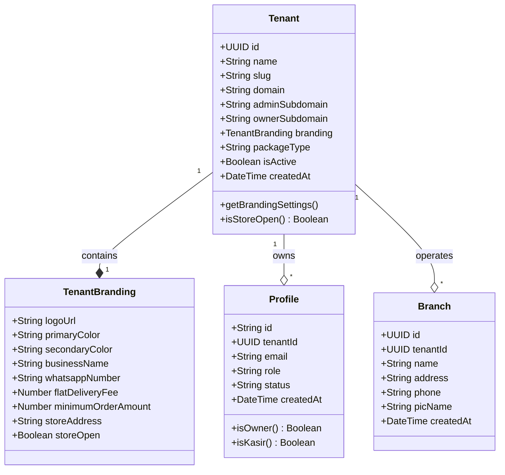
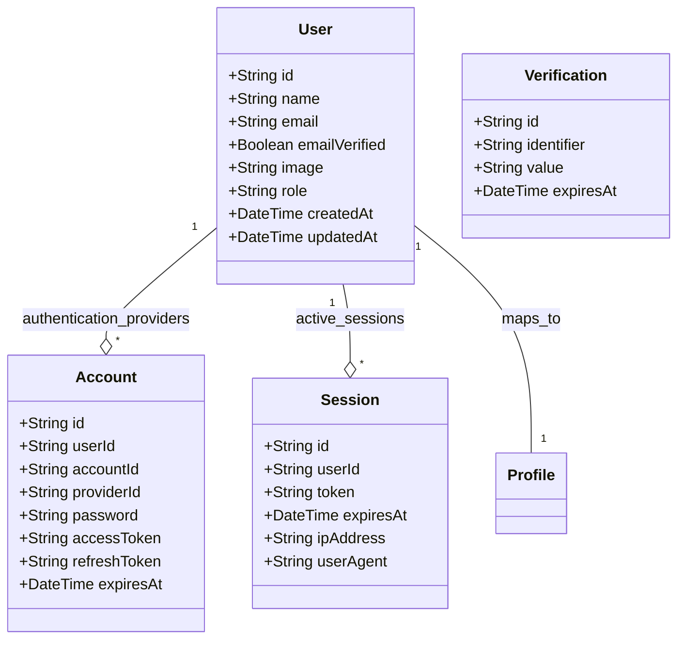
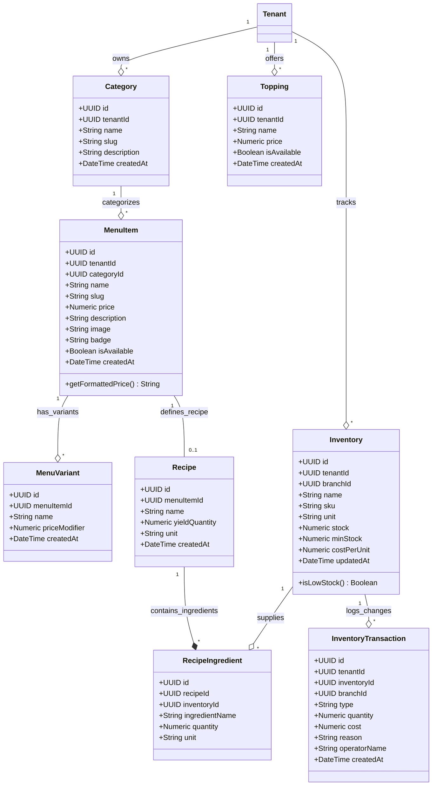
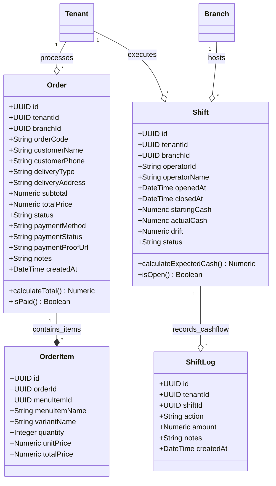
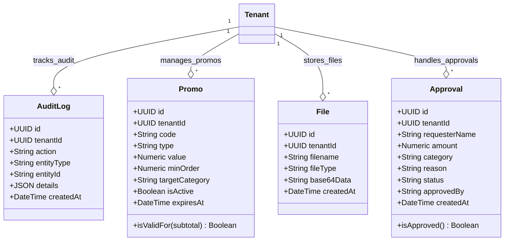
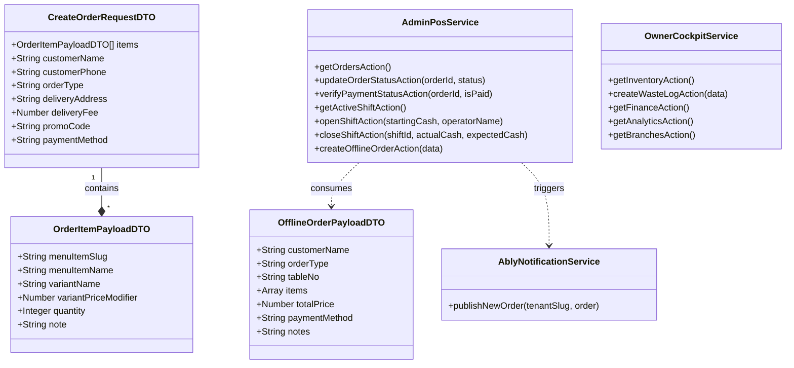

# 🏛️ Dokumentasi Class Diagram Complete - Taj SaaS Platform

Dokumen ini berisi **Class Diagram (Diagram Kelas & Struktur Data Entitas)** lengkap untuk sistem **Taj SaaS (Enterprise Multi-Tenant F&B SaaS Platform)**. 

Class Diagram ini menggambarkan secara rinci struktur kelas entitas database (ORM Drizzle), tipe data interface, Data Transfer Object (DTO), relasi asosiasi/komposisi antar entitas, serta metode *service handler* pada seluruh arsitektur monorepo.

---

## 📑 Daftar Isi Class Diagram
1. [Struktur Kelas Entitas Multi-Tenant & Organisasi](#1-struktur-kelas-entitas-multi-tenant--organisasi)
2. [Diagram Kelas Otentikasi & Akun Pengguna (Better Auth Core)](#2-diagram-kelas-otentikasi--akun-pengguna-better-auth-core)
3. [Diagram Kelas Katalog Menu, Resep BOM, & Inventori](#3-diagram-kelas-katalog-menu-resep-bom--inventori)
4. [Diagram Kelas Transaksi Pesanan & Operasional Kasir (POS)](#4-diagram-kelas-transaksi-pesanan--operasional-kasir-pos)
5. [Diagram Kelas Log, Promosi, File, & Persetujuan](#5-diagram-kelas-log-promosi-file--persetujuan)
6. [Diagram Kelas DTO Payload & Service Handlers](#6-diagram-kelas-dto-payload--service-handlers)
7. **[Tabel Referensi Lengkap Atribut & Metode Kelas](#7-tabel-referensi-lengkap-atribut--metode-kelas)**

---

## 1. Struktur Kelas Entitas Multi-Tenant & Organisasi

Diagram berikut menggambarkan entitas inti multi-tenant `Tenant`, profil pengguna `Profile`, dan cabang bisnis fisik `Branch`.

---

## 2. Diagram Kelas Otentikasi & Akun Pengguna (Better Auth Core)

Diagram ini memperlihatkan entitas otentikasi bawaan engine **Better Auth** dan hubungannya dengan `Profile` bisnis.

---

## 3. Diagram Kelas Katalog Menu, Resep BOM, & Inventori

Diagram ini mendeskripsikan keterkaitan produk menu (`MenuItem`), varian (`MenuVariant`), topping (`Topping`), resep bahan baku (`Recipe`, `RecipeIngredient`), serta persediaan stok gudang (`Inventory`, `InventoryTransaction`).

---

## 4. Diagram Kelas Transaksi Pesanan & Operasional Kasir (POS)

Diagram ini memperlihatkan kelas transaksi pesanan pelanggan (`Order`, `OrderItem`) dan operasional shift kasir (`Shift`, `ShiftLog`).

---

## 5. Diagram Kelas Log, Promosi, File, & Persetujuan

Diagram ini mencakup kelas pendukung sistem seperti `AuditLog`, kupon `Promo`, penyimpanan `File` bukti transfer, dan pengajuan dana `Approval`.

---

## 6. Diagram Kelas DTO Payload & Service Handlers

Diagram ini memetakan kelas-kelas DTO (Data Transfer Object) dan Service Handlers pada Server Next.js.

---

## 7. Tabel Referensi Lengkap Atribut & Metode Kelas

Tabel referensi ini merangkum setiap kelas, tipe data utama, fungsi metode, dan relasi antar kelas dalam repositori Taj SaaS.

| Nama Kelas / Interface | Tipe / Role | Atribut Utama | Metode Utama | Relasi Terkait |
| :--- | :--- | :--- | :--- | :--- |
| **`Tenant`** | DB Entity | `id`, `name`, `slug`, `branding`, `isActive` | `isStoreOpen()` | Owns `Profile`, `Branch`, `Category`, `Order`, `Inventory` |
| **`User`** | Auth Entity | `id`, `name`, `email`, `role` | - | Linked to `Account`, `Session`, `Profile` |
| **`Profile`** | DB Entity | `id`, `tenantId`, `email`, `role`, `status` | `isOwner()`, `isKasir()` | Belongs to `User` & `Tenant` |
| **`Branch`** | DB Entity | `id`, `tenantId`, `name`, `address`, `phone` | - | Belongs to `Tenant`, Hosts `Shift` |
| **`MenuItem`** | DB Entity | `id`, `tenantId`, `categoryId`, `price`, `isAvailable` | `getFormattedPrice()` | Belongs to `Category`, Has `MenuVariant`, `Recipe` |
| **`Recipe`** | DB Entity | `id`, `menuItemId`, `yieldQuantity`, `unit` | - | Linked to `MenuItem`, Has `RecipeIngredient` |
| **`Inventory`** | DB Entity | `id`, `tenantId`, `stock`, `minStock`, `costPerUnit` | `isLowStock()` | Linked to `RecipeIngredient`, Logs `InventoryTransaction` |
| **`Order`** | DB Entity | `id`, `orderCode`, `totalPrice`, `status`, `paymentStatus` | `calculateTotal()`, `isPaid()` | Belongs to `Tenant`, Has `OrderItem` |
| **`Shift`** | DB Entity | `id`, `startingCash`, `actualCash`, `drift`, `status` | `calculateExpectedCash()` | Belongs to `Tenant` & `Branch`, Has `ShiftLog` |
| **`CreateOrderRequestDTO`**| Payload DTO | `items`, `customerName`, `orderType`, `paymentMethod` | - | Consumed by `POST /api/orders` |
| **`AdminPosService`** | Service Class | - | `openShiftAction()`, `closeShiftAction()`, `updateOrderStatusAction()` | Interacts with Drizzle ORM & Ably Service |
| **`OwnerCockpitService`**| Service Class | - | `getInventoryAction()`, `createWasteLogAction()`, `getFinanceAction()` | Interacts with Drizzle ORM & Gemini API |

---

*Dokumentasi Class Diagram ini dibuat secara otomatis dan komprehensif untuk platform Taj SaaS.*
