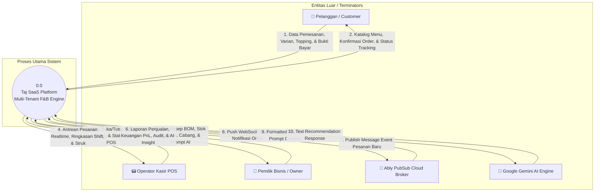
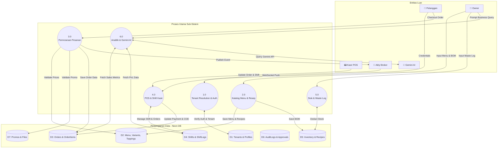
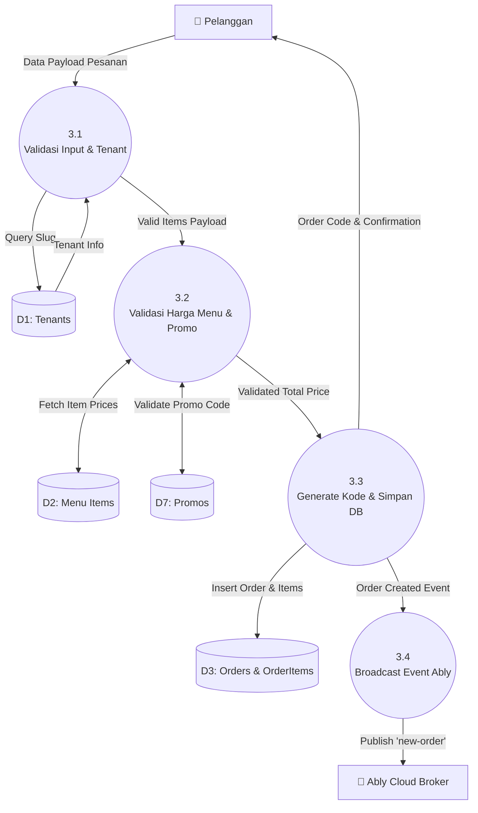
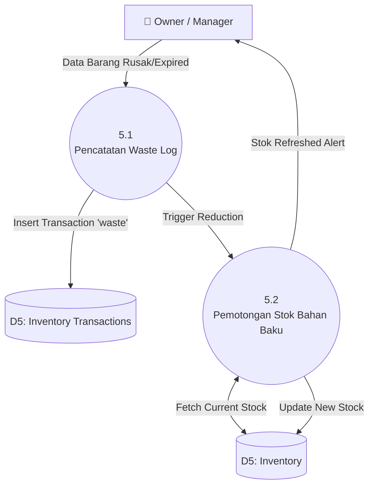

# 🔄 Dokumentasi Data Flow Diagram (DFD) Complete - Taj SaaS Platform

Dokumen ini berisi **Data Flow Diagram (DFD)** lengkap dan terstruktur untuk sistem **Taj SaaS (Enterprise Multi-Tenant F&B SaaS Platform)**. 

DFD ini menggambarkan aliran data (*data flows*), entitas luar (*external entities*), proses pengolahan data (*processes*), dan tempat penyimpanan data (*data stores*) dari tingkat konteks (Level 0), tingkat utama (Level 1), hingga rincian sub-proses spesifik (Level 2).

---

## 📑 Daftar Isi Data Flow Diagram
1. [Notasi & Simbol Diagram Aliran Data](#1-notasi--simbol-diagram-aliran-data)
2. [DFD Level 0: Diagram Konteks (Context Diagram)](#2-dfd-level-0-diagram-konteks-context-diagram)
3. [DFD Level 1: Decomposisi Sistem Utama (Overview Processes)](#3-dfd-level-1-decomposisi-sistem-utama-overview-processes)
4. [DFD Level 2: Rincian Sub-Proses Pemrosesan Pesanan (Proses 3.0)](#4-dfd-level-2-rincian-sub-proses-pemrosesan-pesanan-proses-30)
5. [DFD Level 2: Rincian Sub-Proses Shift & POS Kasir (Proses 4.0)](#5-dfd-level-2-rincian-sub-proses-shift--pos-kasir-proses-40)
6. [DFD Level 2: Rincian Sub-Proses Inventori & Waste Stok (Proses 5.0)](#6-dfd-level-2-rincian-sub-proses-inventori--waste-stok-proses-50)
7. **[Kamus Data Sistem (System Data Dictionary Table)](#7-kamus-data-sistem-system-data-dictionary-table)**

---

## 1. Notasi & Simbol Diagram Aliran Data

- **Entitas Luar (External Entities / Terminators):** Pengguna atau sistem eksternal yang memberikan masukan data atau menerima keluaran data dari sistem (`Pelanggan`, `Kasir POS`, `Pemilik Bisnis`, `Ably Broker`, `Gemini AI`).
- **Proses (Processes):** Fungsi transformasi data yang mengolah masukan menjadi keluaran.
- **Penyimpanan Data (Data Stores):** Tabel basis data Neon Postgres (`D1: Tenants`, `D2: Users`, `D3: Menus`, `D4: Inventory`, `D5: Orders`, `D6: Shifts`, `D7: Audits`).
- **Aliran Data (Data Flows):** Jalur pergerakan informasi antar elemen.

---

## 2. DFD Level 0: Diagram Konteks (Context Diagram)

Diagram Konteks menggambarkan sistem **Taj SaaS Platform (Proses 0.0)** secara keseluruhan dalam hubungannya dengan seluruh Entitas Luar.



---

## 3. DFD Level 1: Decomposisi Sistem Utama (Overview Processes)

Diagram ini memecah **Proses 0.0** menjadi 6 proses subsystem utama dan hubungannya dengan **Data Stores (D1 - D7)**.



---

## 4. DFD Level 2: Rincian Sub-Proses Pemrosesan Pesanan (Proses 3.0)

Diagram ini mendetailkan aliran data internal saat pelanggan melakukan *checkout* pesanan.



---

## 5. DFD Level 2: Rincian Sub-Proses Shift & POS Kasir (Proses 4.0)

Diagram ini mendetailkan aliran data saat kasir membuka shift, mengelola status pesanan, dan menutup shift.

```mermaid
graph TD
    E_POS[📟 Operator Kasir] -->|Input Modal Awal| P4_1((4.1<br/>Pembukaan Shift Kasir))
    P4_1 -->|Insert Active Shift| D4[(D4: Shifts & ShiftLogs)]
    
    E_ABLY[📡 Ably Broker] -->|WebSocket Event| P4_2((4.2<br/>Queue Notifikasi Pesanan))
    D3[(D3: Orders)] <-->|Fetch Active Orders| P4_2
    P4_2 -->|Render Realtime List| E_POS
    
    E_POS -->|Klik Status Order| P4_3((4.3<br/>Update Status & Log Kas))
    P4_3 -->|Update Order Status| D3
    P4_3 -->|Write Audit Log| D6[(D6: Audit Logs)]
    
    opt Order COD Completed
        P4_3 -->|Write Cash-In Log| D4
    end
    
    E_POS -->|Input Uang Fisik Laci| P4_4((4.4<br/>Tutup Shift & Rekonsiliasi))
    P4_4 <-->|Fetch Shift Cash Logs| D4
    P4_4 -->|Kalkulasi Drift & Close Shift| D4
    P4_4 -->|Struk Ringkasan Shift| E_POS
```

---

## 6. DFD Level 2: Rincian Sub-Proses Inventori & Waste Stok (Proses 5.0)

Diagram ini mendetailkan aliran data saat laporan barang rusak/expired (*waste*) dibuat.



---

## 7. Kamus Data Sistem (System Data Dictionary Table)

Tabel berikut mendokumentasikan rincian paket aliran data (*data flow packages*), elemen data, asal data (*source*), dan tujuan data (*destination*).

| Nama Aliran Data (Data Flow) | Asal Data (Source) | Tujuan Data (Destination) | Struktur Elemen Data Utama |
| :--- | :--- | :--- | :--- |
| **Data Pemesanan Pelanggan** | Pelanggan (`Customer App`) | Proses `3.1 Validasi Input` | `items[]`, `customerName`, `customerPhone`, `orderType`, `deliveryAddress`, `promoCode`, `paymentMethod` |
| **Katalog Menu Response** | Proses `2.0 Katalog Menu` | Pelanggan (`Customer App`) | `categories[]`, `menuItems[]`, `variants[]`, `toppings[]`, `branding` |
| **Order Insert Record** | Proses `3.3 Simpan DB` | Data Store `D3 Orders` | `id`, `tenantId`, `orderCode`, `totalPrice`, `status='received'`, `paymentStatus='pending'` |
| **Realtime Broadcast Event** | Proses `3.4 Broadcast` | Ably Broker (`E4`) | `channel='orders:slug'`, `event='new-order'`, `orderPayload` |
| **Input Buka Shift** | Kasir POS (`E2`) | Proses `4.1 Buka Shift` | `startingCash`, `operatorName`, `openedAt` |
| **Input Tutup Shift** | Kasir POS (`E2`) | Proses `4.4 Tutup Shift` | `shiftId`, `actualCash`, `expectedCash`, `drift` |
| **Input Waste Log** | Owner (`E3`) | Proses `5.1 Waste Log` | `inventoryId`, `branchId`, `quantity`, `cost`, `reason`, `operatorName` |
| **Prompt Query AI** | Owner (`E3`) | Proses `6.0 Gemini AI` | `prompt`, `tenantSlug`, `formattedContext` |

---

*Dokumentasi Data Flow Diagram (DFD) ini dibuat secara otomatis dan komprehensif untuk Taj SaaS Platform.*
