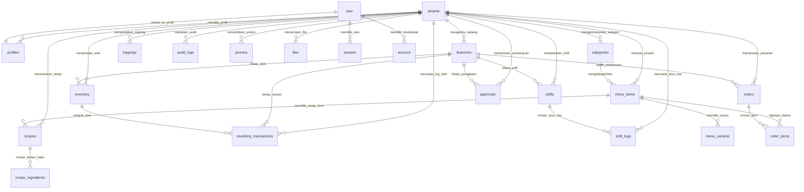
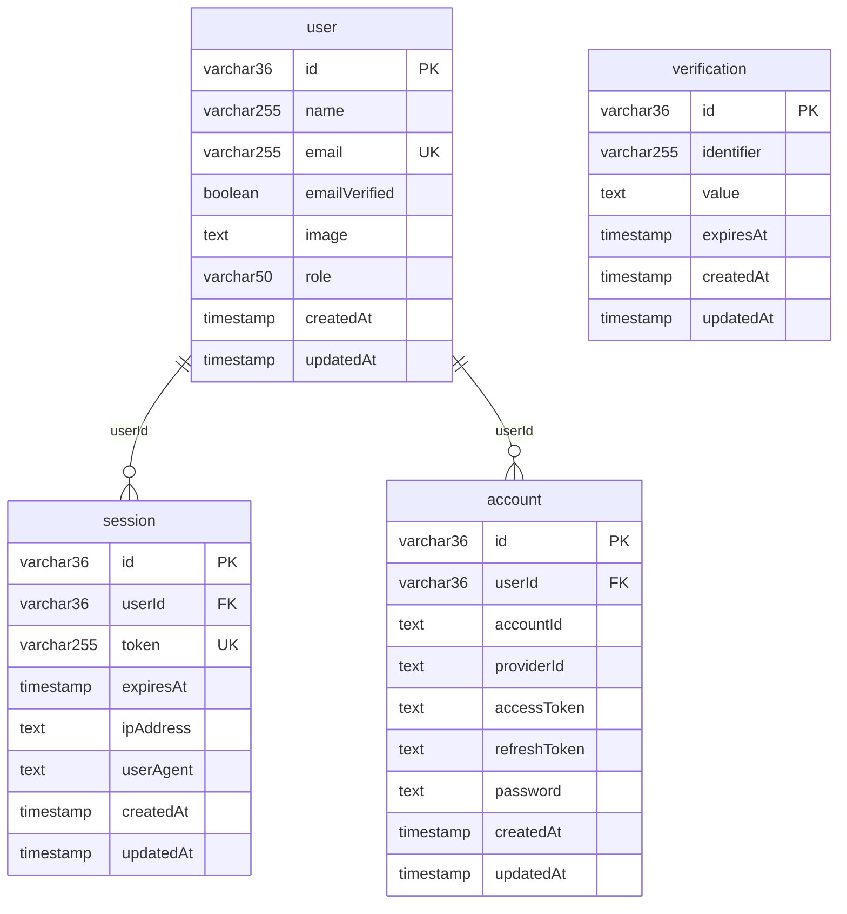
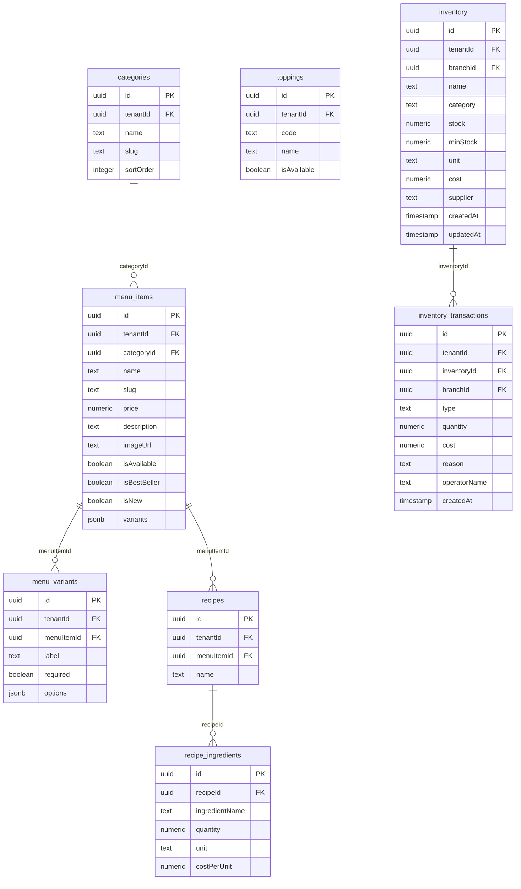
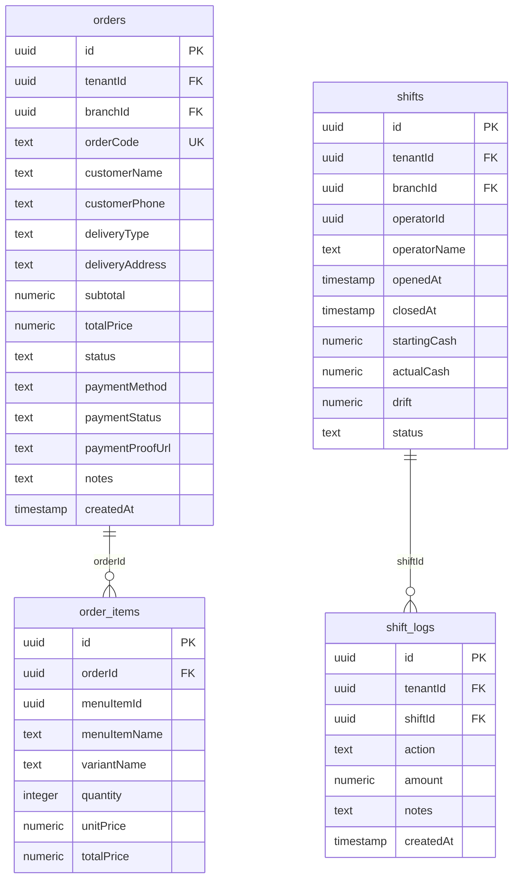
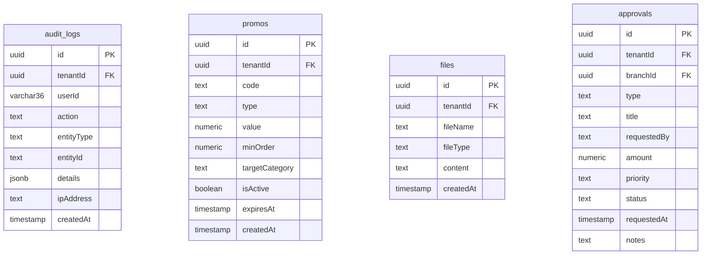

# 🗄️ Dokumentasi ERD (Entity-Relationship Diagram) Complete - Taj SaaS Platform

Dokumen ini berisi **ERD (Entity-Relationship Diagram)** resmi dan komprehensif untuk basis data **Neon Serverless Postgres** yang digunakan oleh sistem **Taj SaaS (Enterprise Multi-Tenant F&B SaaS Platform)** (`packages/db/schema.ts`).

Setiap tabel dirancang dengan pola **Multi-Tenant Data Isolation**, di mana kolom `tenant_id` terindeks secara aman untuk menjamin isolasi data antar penyewa bisnis F&B.

---

## 📑 Daftar Isi ERD
1. [Ringkasan Arsitektur Database & Konvensi Schema](#1-ringkasan-arsitektur-database--konvensi-schema)
2. [Diagram ERD Visual Utama (Mermaid Diagram)](#2-diagram-erd-visual-utama-mermaid-diagram)
3. [Kelompok 1: Tabel Otentikasi (Better Auth Core)](#3-kelompok-1-tabel-otentikasi-better-auth-core)
4. [Kelompok 2: Tabel Multi-Tenant & Organisasi Bisnis](#4-kelompok-2-tabel-multi-tenant--organisasi-bisnis)
5. [Kelompok 3: Tabel Produk, Resep BOM, & Inventori F&B](#5-kelompok-3-tabel-produk-resep-bom--inventori-fb)
6. [Kelompok 4: Tabel Transaksi Pesanan, POS, & Shift Kasir](#6-kelompok-4-tabel-transaksi-pesanan-pos--shift-kasir)
7. [Kelompok 5: Tabel Audit Log, Promosi, File, & Persetujuan](#7-kelompok-5-tabel-audit-log-promosi-file--persetujuan)
8. **[Matriks Relasi & Kamus Data Lengkap (Full Data Dictionary Matrix)](#8-matriks-relasi--kamus-data-lengkap-full-data-dictionary-matrix)**

---

## 1. Ringkasan Arsitektur Database & Konvensi Schema

- **DBMS:** Neon Serverless Postgres
- **ORM:** Drizzle ORM (`@taj-saas/db`)
- **Total Tabel:** 23 Tabel Utama
- **Primary Key Strategy:** 
  - Better Auth Tables: `varchar(36)` (UUID string).
  - Business Tables: `uuid` (Autogenerated `defaultRandom()`).
- **Foreign Key Indexing:** Seluruh kolom `tenant_id`, `user_id`, `branch_id`, `order_id`, `shift_id`, `inventory_id` memiliki indeks khusus (`index()`) untuk performa tinggi.

---

## 2. Diagram ERD Visual Utama (Mermaid Diagram)

Diagram berikut menampilkan hubungan kardinalitas (`1:1`, `1:N`, `N:M`) antar seluruh 23 entitas pada database Taj SaaS.



---

## 3. Kelompok 1: Tabel Otentikasi (Better Auth Core)

Merupakan 4 tabel inti yang digunakan oleh engine **Better Auth** untuk otentikasi pendaftaran, login, dan manajemen sesi.



---

## 4. Kelompok 2: Tabel Multi-Tenant & Organisasi Bisnis

Tabel-tabel ini menyimpan identitas entitas bisnis F&B (`tenants`), profil pengguna berorientasi peran (`profiles`), dan gerai cabang fisik (`branches`).

```mermaid
erDiagram
    tenants {
        uuid id PK
        text name
        text slug UK
        text domain UK
        text adminSubdomain
        text ownerSubdomain
        jsonb branding
        text packageType
        boolean isActive
        timestamp createdAt
    }

    profiles {
        varchar36 id PK_FK
        uuid tenantId FK
        text email
        text role
        numeric salary
        timestamp createdAt
    }

    branches {
        uuid id PK
        uuid tenantId FK
        text name
        text city
        text address
        text phone
        text picName
        text status
        timestamp createdAt
        timestamp updatedAt
    }

    tenants ||--o{ profiles : "tenantId"
    tenants ||--o{ branches : "tenantId"
```

---

## 5. Kelompok 3: Tabel Produk, Resep BOM, & Inventori F&B

Struktur pendataan katalog menu produk, opsi varian/topping, resep komposisi bahan baku (Bill of Materials), serta pergerakan stok gudang.



---

## 6. Kelompok 4: Tabel Transaksi Pesanan, POS, & Shift Kasir

Menyimpan data transaksi pembelian pelanggan (`orders`, `order_items`) serta catatan shift operasional kasir POS (`shifts`, `shift_logs`).



---

## 7. Kelompok 5: Tabel Audit Log, Promosi, File, & Persetujuan

Tabel pendukung untuk audit aktivitas pengguna, voucher promo, file lampiran bukti transfer QRIS, dan pengajuan dana pengeluaran kasir.



---

## 8. Matriks Relasi & Kamus Data Lengkap (Full Data Dictionary Matrix)

Tabel berikut menyajikan rincian lengkap 23 entitas, fungsi bisnis utama, kunci relasi (Primary Key & Foreign Key), serta tabel terkait.

| Nama Tabel | Fungsi Utama Bisnis | Primary Key (PK) | Foreign Key (FK) & Referensi | Relasi Kardinalitas |
| :--- | :--- | :--- | :--- | :--- |
| **`user`** | Data pengguna terdaftar sistem | `id` (VARCHAR 36) | - | `1:N` ke `session`, `account`, `1:1` ke `profiles` |
| **`session`** | Token sesi login aktif | `id` (VARCHAR 36) | `userId` $\rightarrow$ `user.id` | `N:1` ke `user` |
| **`account`** | Kredensial kata sandi & OAuth | `id` (VARCHAR 36) | `userId` $\rightarrow$ `user.id` | `N:1` ke `user` |
| **`verification`**| Token verifikasi email / reset | `id` (VARCHAR 36) | - | Independen |
| **`tenants`** | Profil entitas bisnis penyewa | `id` (UUID) | - | `1:N` ke seluruh tabel bisnis multi-tenant |
| **`profiles`** | Mapping user ke tenant & Role | `id` (VARCHAR 36) | `tenantId` $\rightarrow$ `tenants.id` | `1:1` ke `user`, `N:1` ke `tenants` |
| **`branches`** | Outlet/gerai cabang fisik | `id` (UUID) | `tenantId` $\rightarrow$ `tenants.id` | `N:1` ke `tenants`, `1:N` ke `shifts`, `inventory` |
| **`categories`** | Kategori kelompok produk menu | `id` (UUID) | `tenantId` $\rightarrow$ `tenants.id` | `N:1` ke `tenants`, `1:N` ke `menu_items` |
| **`menu_items`** | Katalog produk makanan & minuman | `id` (UUID) | `categoryId` $\rightarrow$ `categories.id` | `N:1` ke `categories`, `1:N` ke `menu_variants`, `recipes` |
| **`menu_variants`**| Opsi pilihan ukuran/rasa produk | `id` (UUID) | `menuItemId` $\rightarrow$ `menu_items.id` | `N:1` ke `menu_items` |
| **`toppings`** | Extra topping/add-on produk | `id` (UUID) | `tenantId` $\rightarrow$ `tenants.id` | `N:1` ke `tenants` |
| **`recipes`** | Header kartu resep (BOM) | `id` (UUID) | `menuItemId` $\rightarrow$ `menu_items.id` | `N:1` ke `menu_items`, `1:N` ke `recipe_ingredients` |
| **`recipe_ingredients`**| Detail takaran bahan baku resep | `id` (UUID) | `recipeId` $\rightarrow$ `recipes.id` | `N:1` ke `recipes` |
| **`inventory`** | Stok bahan baku di gudang | `id` (UUID) | `branchId` $\rightarrow$ `branches.id` | `N:1` ke `tenants` & `branches`, `1:N` ke `inventory_transactions` |
| **`inventory_transactions`**| Log mutasi keluar/masuk/waste | `id` (UUID) | `inventoryId` $\rightarrow$ `inventory.id` | `N:1` ke `inventory` |
| **`orders`** | Pesanan transaksi pelanggan | `id` (UUID) | `branchId` $\rightarrow$ `branches.id` | `N:1` ke `tenants`, `1:N` ke `order_items` |
| **`order_items`** | Line item produk pesanan | `id` (UUID) | `orderId` $\rightarrow$ `orders.id` | `N:1` ke `orders` |
| **`shifts`** | Shift operasional kasir POS | `id` (UUID) | `branchId` $\rightarrow$ `branches.id` | `N:1` ke `tenants`, `1:N` ke `shift_logs` |
| **`shift_logs`** | Catatan arus kas laci kasir | `id` (UUID) | `shiftId` $\rightarrow$ `shifts.id` | `N:1` ke `shifts` |
| **`audit_logs`** | Rekam jejak audit sistem | `id` (UUID) | `tenantId` $\rightarrow$ `tenants.id` | `N:1` ke `tenants` |
| **`promos`** | Kode kupon voucher diskon | `id` (UUID) | `tenantId` $\rightarrow$ `tenants.id` | `N:1` ke `tenants` |
| **`files`** | Storage gambar bukti bayar QRIS | `id` (UUID) | `tenantId` $\rightarrow$ `tenants.id` | `N:1` ke `tenants` |
| **`approvals`** | Pengajuan persetujuan dana kasir | `id` (UUID) | `branchId` $\rightarrow$ `branches.id` | `N:1` ke `tenants` & `branches` |

---

*Dokumentasi ERD ini dibuat secara otomatis dan komprehensif untuk basis data Taj SaaS Platform.*
