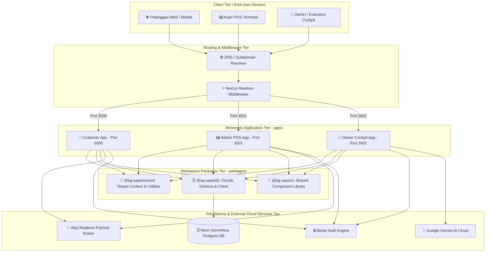
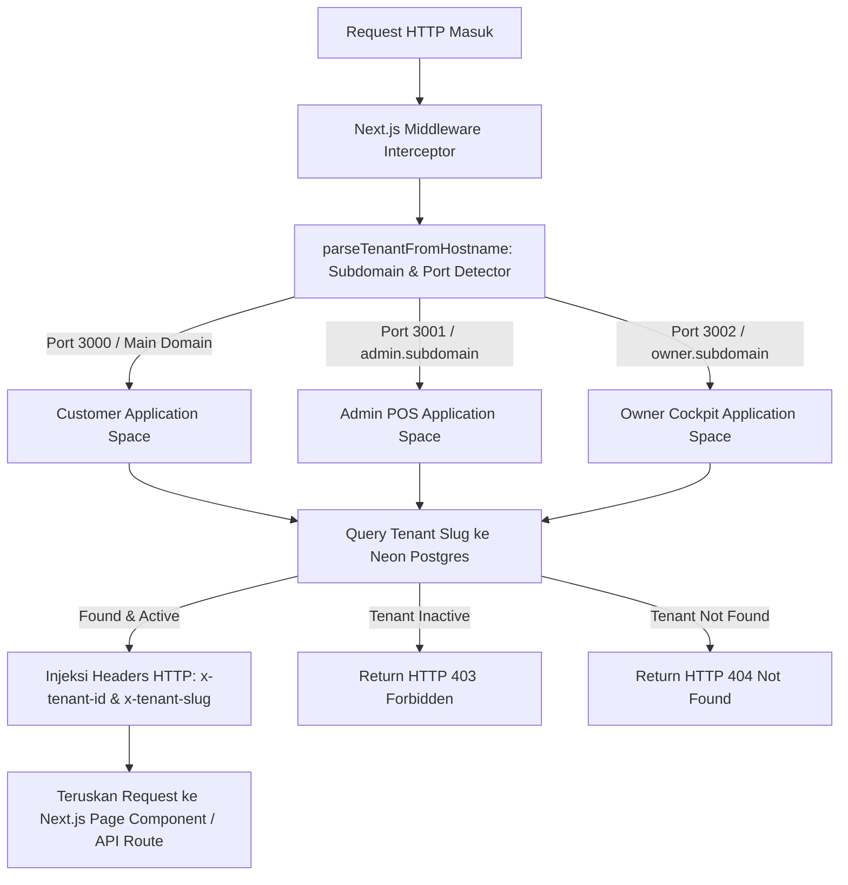
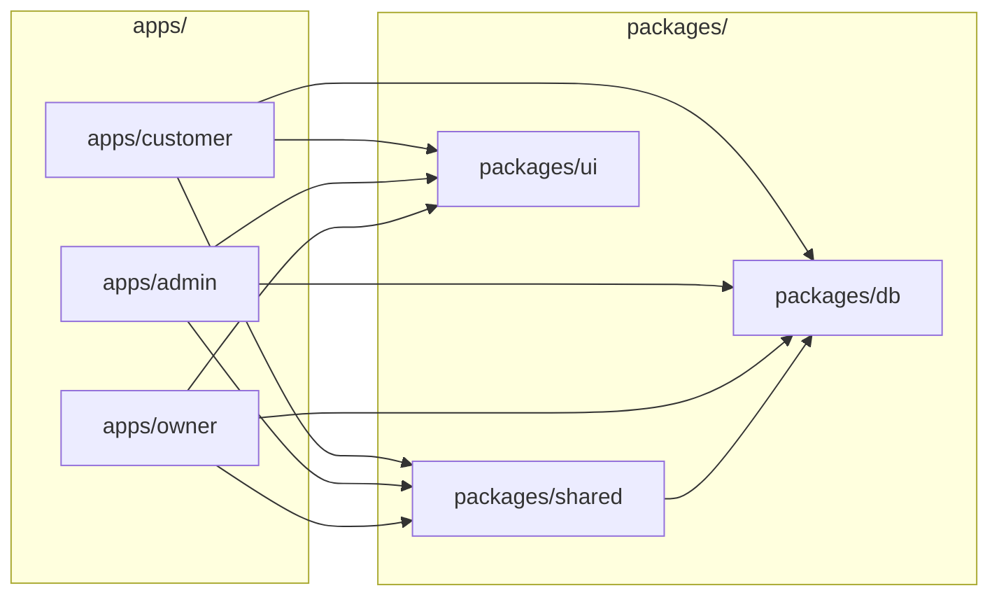
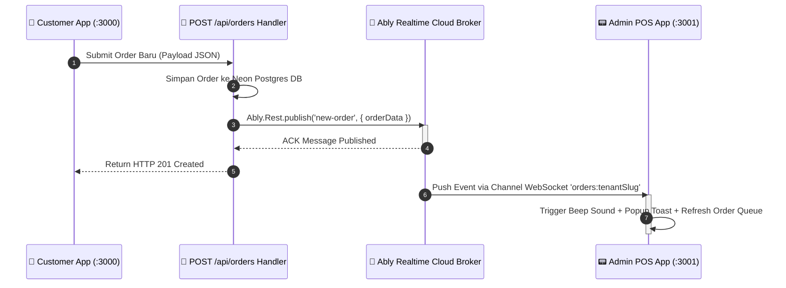
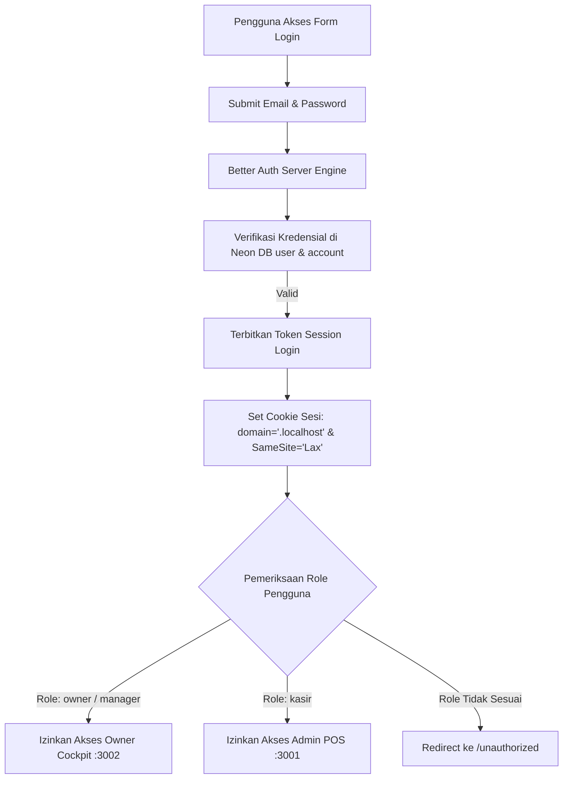
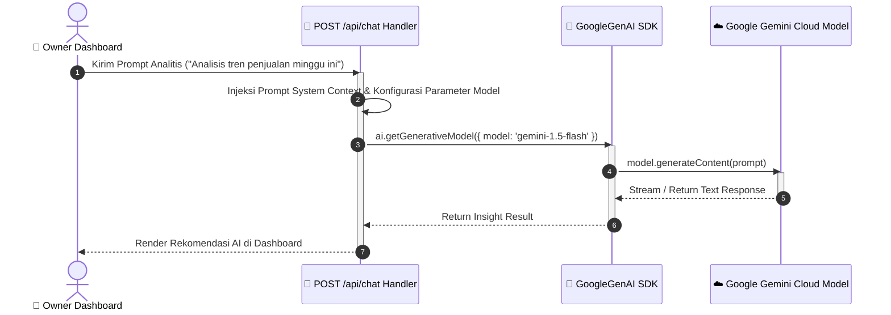

# 🏗️ Dokumentasi System Architecture Diagram (SAD) Complete - Taj SaaS Platform

Dokumen resmi **System Architecture Diagram (SAD)** ini mendokumentasikan arsitektur sistem tingkat tinggi (*high-level topology*), komponen monorepo, aliran data multi-tenant, batas keamanan (*security boundaries*), sistem real-time, dan integrasi kecerdasan buatan (AI) pada **Taj SaaS (Enterprise Multi-Tenant F&B SaaS Platform)**.

---

## 📑 Daftar Isi System Architecture Document
1. [Visi & Ringkasan Arsitektur Sistem](#1-visi--ringkasan-arsitektur-sistem)
2. [Topologi Arsitektur Tingkat Tinggi (High-Level Topology)](#2-topologi-arsitektur-tingkat-tinggi-high-level-topology)
3. [Arsitektur Resolution & Routing Multi-Tenant](#3-arsitektur-resolution--routing-multi-tenant)
4. [Struktur Monorepo & Dependensi Antar Paket](#4-struktur-monorepo--dependensi-antar-paket)
5. [Arsitektur Notifikasi Real-time (Ably PubSub Broker)](#5-arsitektur-notifikasi-real-time-ably-pubsub-broker)
6. [Arsitektur Otentikasi & Keamanan (Better Auth & Subdomain Cookies)](#6-arsitektur-otentikasi--keamanan-better-auth--subdomain-cookies)
7. [Arsitektur Data & Persistence Layer (Drizzle ORM + Neon Postgres)](#7-arsitektur-data--persistence-layer-drizzle-orm--neon-postgres)
8. [Arsitektur Integrasi AI Assistant (Google Gemini AI)](#8-arsitektur-integrasi-ai-assistant-google-gemini-ai)
9. **[Matriks Keputusan Arsitektur & Technology Stack (Architectural Matrix)](#9-matriks-keputusan-arsitektur--technology-stack-architectural-matrix)**

---

## 1. Visi & Ringkasan Arsitektur Sistem

**Taj SaaS** dibangun dengan arsitektur **Zero-Supabase Multi-Tenant SaaS** berkinerja tinggi untuk bisnis Food & Beverage (F&B). Sistem ini sepenuhnya terisolasi antar penyewa (*tenant-isolated*) dari tingkat routing HTTP, ORM query scope, channel notifikasi real-time, hingga cookie otentikasi.

- **Monorepo Engine:** Turborepo + pnpm Workspaces
- **Frontend App Router:** Next.js (TypeScript)
- **Database Engine:** Neon Serverless Postgres
- **ORM & Data Mapper:** Drizzle ORM
- **Auth Provider:** Better Auth (dengan Subdomain Session Sharing)
- **Real-time PubSub Broker:** Ably Cloud Channels
- **AI Intelligence Engine:** Google Gemini AI API

---

## 2. Topologi Arsitektur Tingkat Tinggi (High-Level Topology)

Diagram berikut menggambarkan secara menyeluruh struktur 5-tier dari Client Layer hingga External Cloud Infrastructure.



---

## 3. Arsitektur Resolution & Routing Multi-Tenant

Sistem resolusi multi-tenant dinamis tanpa perlu konfigurasi file `hosts` sistem operasi pada lingkungan pengembangan lokal.



---

## 4. Struktur Monorepo & Dependensi Antar Paket

Grafik ketergantungan internal pada Turborepo workspace.



---

## 5. Arsitektur Notifikasi Real-time (Ably PubSub Broker)

Arsitektur pesan pub/sub tanpa polling database (*Zero DB Polling*) untuk menyiarkan pesanan baru dari pelanggan ke layar POS kasir.



---

## 6. Arsitektur Otentikasi & Keamanan (Better Auth & Subdomain Cookies)

Skema keamanan otentikasi lintas subdomain menggunakan `COOKIE_DOMAIN=.localhost` dan pengecekan Role-Based Access Control (RBAC).



---

## 7. Arsitektur Data & Persistence Layer (Drizzle ORM + Neon Postgres)

Arsitektur lapisan data menggunakan **Drizzle ORM** dan **Neon Serverless Postgres** dengan jaminan kueri terisolasi per tenant.

```mermaid
graph TD
    subgraph Application_Layer [Application Layer]
        SA[Next.js Server Actions / API Routes]
    end

    subgraph Data_Access_Layer [@taj-saas/db Package]
        DRIZZLE[Drizzle ORM Client]
        SCHEMA[Drizzle Schema Definitions]
    end

    subgraph Database_Layer [Neon Postgres Serverless]
        PG_POOL[Neon HTTP / Serverless Connection Pool]
        TABLES[(23 Tabel Multi-Tenant Data Isolated)]
    end

    SA --> DRIZZLE
    DRIZZLE --> SCHEMA
    SCHEMA --> PG_POOL
    PG_POOL --> TABLES
```

---

## 8. Arsitektur Integrasi AI Assistant (Google Gemini AI)

Integrasi kecerdasan buatan pada Owner Cockpit untuk analisis tren penjualan dan rekomendasi inventori.



---

## 9. Matriks Keputusan Arsitektur & Technology Stack (Architectural Matrix)

Tabel berikut merangkum keputusan arsitektural utama, teknologi yang dipilih, alasan pemilihan, dan manfaat bagi platform Taj SaaS.

| Komponen Arsitektur | Teknologi Terpilih | Alasan & Rasionalisasi Desain | Manfaat Utama |
| :--- | :--- | :--- | :--- |
| **Monorepo Manager** | Turborepo + pnpm | Mengelola 3 aplikasi Next.js & 3 shared packages dalam 1 repository. | Build Caching super cepat, shared code reuse 100%. |
| **Application Framework**| Next.js App Router | Pemanfaatan Server Components & Server Actions modern. | SEO optimal di customer app, performa tinggi di dashboard. |
| **Database Engine** | Neon Serverless Postgres | Database Postgres serverless yang dapat menskala otomatis secara independen. | Koneksi HTTP serverless, efisiensi biaya, auto-scaling. |
| **ORM & Query Mapper** | Drizzle ORM | Type-safe SQL query builder tanpa overhead runtime heavyweight. | Type-safety 100%, kueri eksplisit berkinerja tinggi. |
| **Authentication Engine**| Better Auth Engine | Pengganti Supabase Auth dengan fleksibilitas hook database kustom. | Otomatisasi pembagian sesi cookie di seluruh subdomain. |
| **Realtime PubSub** | Ably Realtime Cloud | Serverless WebSocket messaging terisolasi per channel tenant. | POS menerima pesanan instan tanpa polling database. |
| **Artificial Intelligence**| Google Gemini AI SDK | Engine pemrosesan AI tingkat lanjut untuk insight analitik F&B. | Owner mendapat asisten AI untuk optimasi bisnis. |

---

*Dokumen System Architecture Diagram (SAD) ini dibuat secara otomatis dan komprehensif untuk Taj SaaS Platform.*
