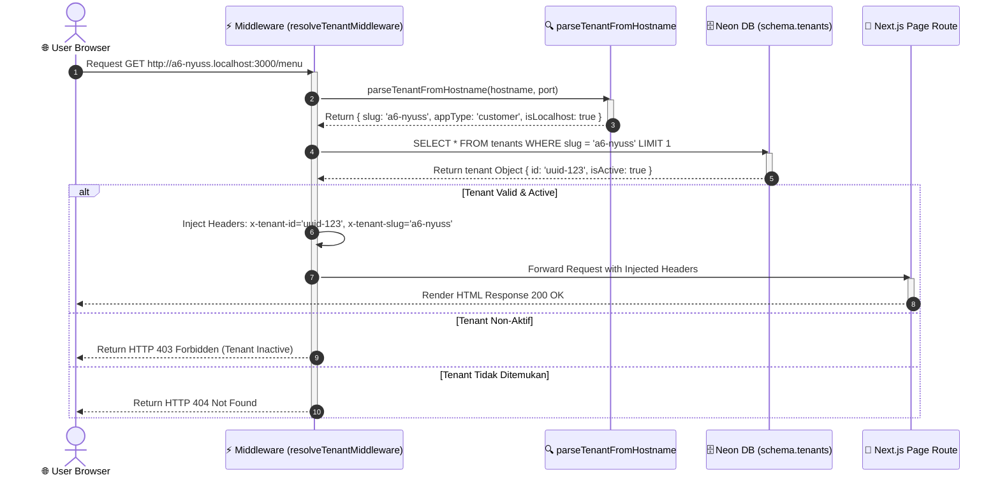
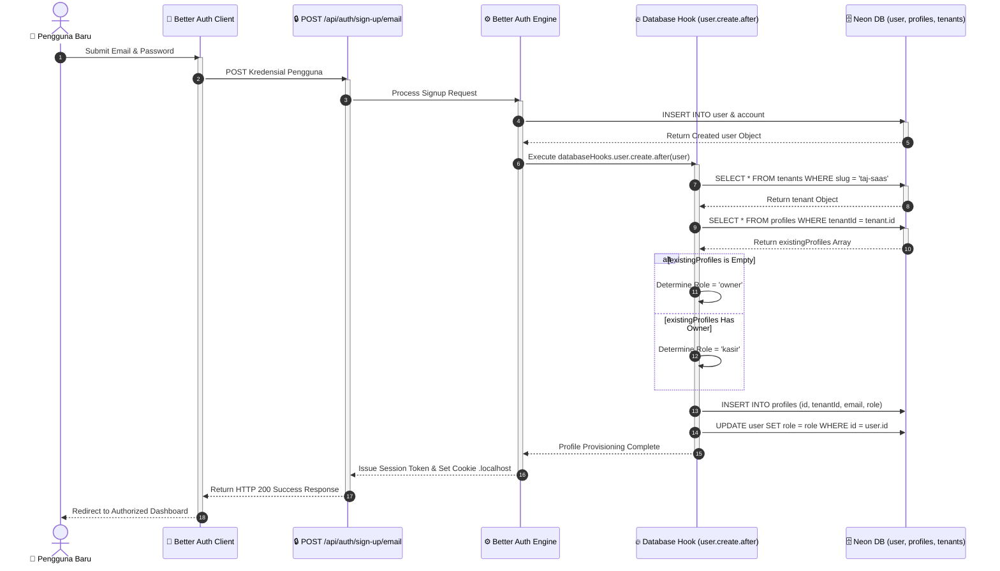
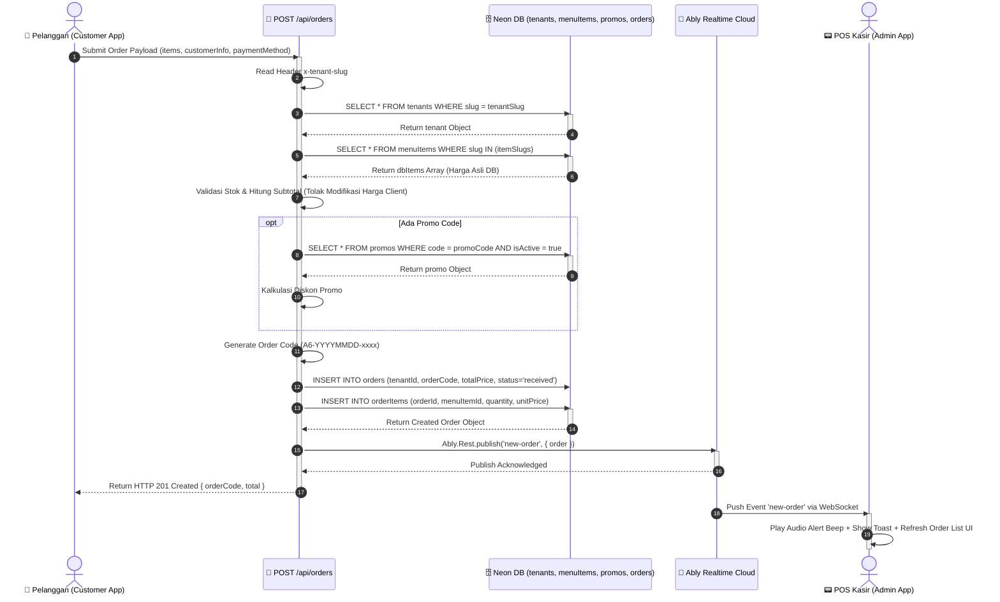
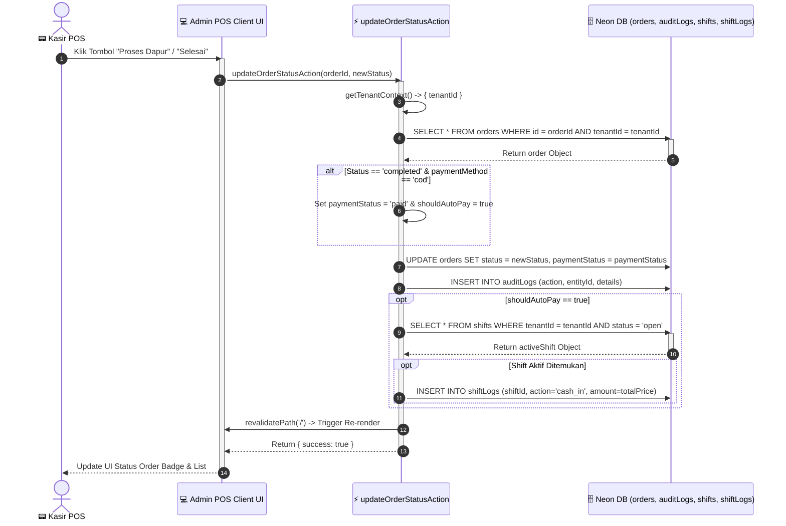
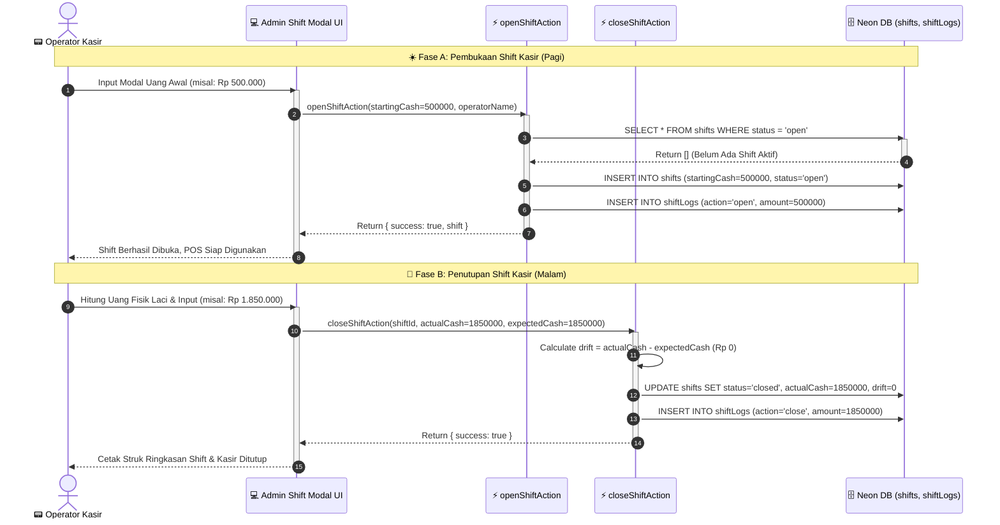
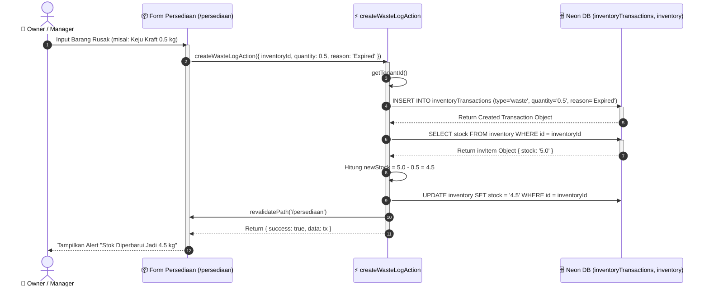
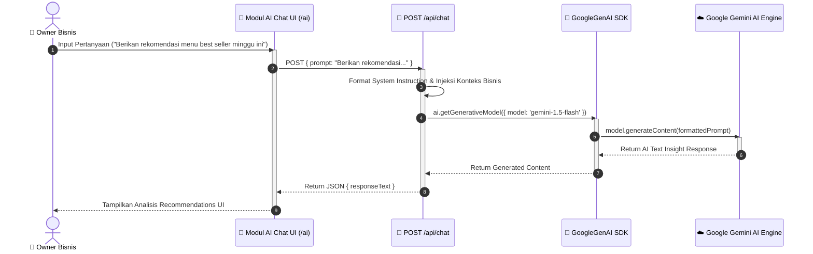

# ⏱️ Dokumentasi Sequence Diagram Complete - Taj SaaS Platform

Dokumen ini berisi **Sequence Diagram (Diagram Urutan Eksekusi)** lengkap untuk sistem **Taj SaaS (Enterprise Multi-Tenant F&B SaaS Platform)**. 

Sequence Diagram ini mengilustrasikan secara kronologis pertukaran pesan (*message exchange*), pemanggilan fungsi, interaksi komponen, dan aliran kontrol antar aktor/sistem dari waktu ke waktu untuk skenario operasional utama.

---

## 📑 Daftar Isi Sequence Diagram
1. [Skenario 1: Intersepsi Request HTTP & Injeksi Header Multi-Tenant](#1-skenario-1-intersepsi-request-http--injeksi-header-multi-tenant)
2. [Skenario 2: Pendaftaran User & Auto-Provisioning Profile (Better Auth)](#2-skenario-2-pendaftaran-user--auto-provisioning-profile-better-auth)
3. [Skenario 3: Transaksi Pesanan Pelanggan & Broadcast Real-time](#3-skenario-3-transaksi-pesanan-pelanggan--broadcast-real-time)
4. [Skenario 4: Pengelolaan Status Pesanan oleh Kasir POS](#4-skenario-4-pengelolaan-status-pesanan-oleh-kasir-pos)
5. [Skenario 5: Operasional Shift Kasir (Buka Shift & Tutup Shift Rekonsiliasi)](#5-skenario-5-operasional-shift-kasir-buka-shift--tutup-shift-rekonsiliasi)
6. [Skenario 6: Pencatatan Waste Stok & Pemotongan Inventori resmi](#6-skenario-6-pencatatan-waste-stok--pemotongan-inventori-resmi)
7. [Skenario 7: Asisten AI Business Insight (Google Gemini AI)](#7-skenario-7-asisten-ai-business-insight-google-gemini-ai)
8. **[Tabel Penelusuran Skenario Urutan Sistem (Sequence Scenario Trace Table)](#8-tabel-penelusuran-skenario-urutan-sistem-sequence-scenario-trace-table)**

---

## 1. Skenario 1: Intersepsi Request HTTP & Injeksi Header Multi-Tenant

Diagram ini menunjukkan urutan eksekusi `Next.js Middleware` ketika menangkap request masuk dari browser, memvalidasi slug tenant dari database, dan memasukkan header context.

---

## 2. Skenario 2: Pendaftaran User & Auto-Provisioning Profile (Better Auth)

Diagram ini mengalirkan proses pendaftaran pengguna baru, eksekusi hook otomatis Better Auth, dan pembuatan profil bisnis tenant.

---

## 3. Skenario 3: Transaksi Pesanan Pelanggan & Broadcast Real-time

Diagram urutan paling krusial: Pelanggan melakukan submit checkout pesanan, server memvalidasi harga dari DB, menyimpan pesanan, dan menyiarkan notifikasi ke kasir via Ably PubSub.

---

## 4. Skenario 4: Pengelolaan Status Pesanan oleh Kasir POS

Diagram urutan saat kasir menerima notifikasi, memverifikasi pembayaran QRIS, dan memperbarui status tahapan dapur hingga selesai.

---

## 5. Skenario 5: Operasional Shift Kasir (Buka Shift & Tutup Shift Rekonsiliasi)

Diagram urutan pembukaan modal laci awal dan penghitungan selisih (*drift*) saat kasir menutup shift operasional.

---

## 6. Skenario 6: Pencatatan Waste Stok & Pemotongan Inventori resmi

Diagram urutan ketika pemilik/manajer mencatat bahan baku rongsok/expired (*waste log*) yang secara otomatis memotong stok gudang.

---

## 7. Skenario 7: Asisten AI Business Insight (Google Gemini AI)

Diagram urutan pengiriman prompt analitik dari dashboard Owner ke API Route dan eksekusi pada SDK Google Gemini AI.

---

## 8. Tabel Penelusuran Skenario Urutan Sistem (Sequence Scenario Trace Table)

Tabel berikut merangkum aktor awal, pemicu pesan, urutan komponen eksekusi, dan hasil akhir untuk setiap skenario dalam repositori Taj SaaS.

| No | Nama Skenario | Pemicu (Trigger Event) | Komponen Komunikasi Utama | Hasil Akhir (Final State) |
| :---: | :--- | :--- | :--- | :--- |
| **1** | **Intersepsi Multi-Tenant** | Request HTTP Browser | `Middleware` $\rightarrow$ `Parser` $\rightarrow$ `Neon DB` $\rightarrow$ `Headers` | Request diteruskan dengan header `x-tenant-id` |
| **2** | **Auto-Provision Profile** | Submit Signup Email | `Better Auth` $\rightarrow$ `Database Hook` $\rightarrow$ `Neon DB` | Account dibuat, profile ter-seed, cookie set |
| **3** | **Checkout & Broadcast** | Click Submit Order | `POST /api/orders` $\rightarrow$ `DB Insert` $\rightarrow$ `Ably` $\rightarrow$ `POS` | Order tersimpan & POS menerima notifikasi suara |
| **4** | **Update Status Order POS** | Click Update Status UI | `Admin Action` $\rightarrow$ `DB Update` $\rightarrow$ `AuditLog` $\rightarrow$ `ShiftLog` | Status order terbarui & log kas masuk tercatat |
| **5** | **Rekonsiliasi Shift POS** | Input Fisik Uang Laci | `closeShiftAction` $\rightarrow$ `Drift Math` $\rightarrow$ `DB Update` | Shift ditutup & selisih laci kasir tercatat |
| **6** | **Waste Stock Log** | Form Input Barang Rusak | `createWasteLogAction` $\rightarrow$ `DB Tx` $\rightarrow$ `Stock Deduction` | Transaksi waste tercatat & stok gudang terpotong |
| **7** | **Gemini AI Insight** | Prompt Query Owner | `AI Chat UI` $\rightarrow$ `POST /api/chat` $\rightarrow$ `Gemini AI Engine` | Insight rekomendasi bisnis ditampilkan di UI |

---

*Dokumentasi Sequence Diagram ini dibuat secara otomatis dan komprehensif untuk platform Taj SaaS.*
