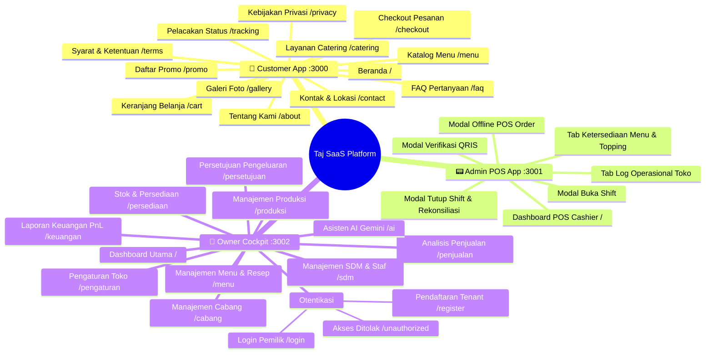
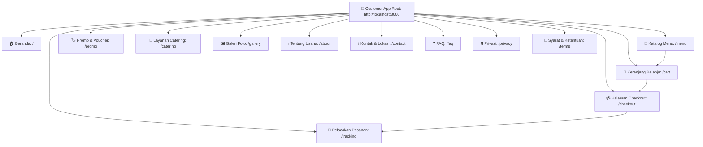
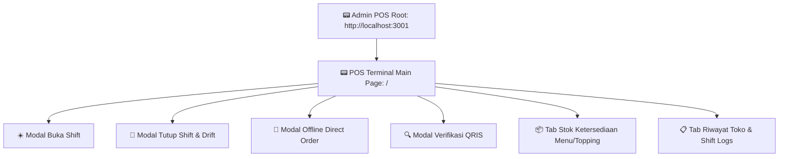
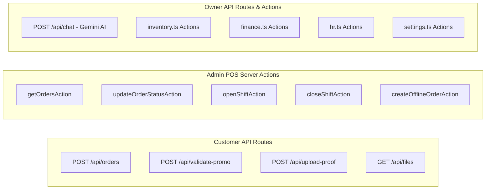

# 🗺️ Dokumentasi Sitemap Complete - Taj SaaS Platform

Dokumen ini berisi **Sitemap (Peta Situs & Struktur Navigasi Halaman)** lengkap untuk sistem **Taj SaaS (Enterprise Multi-Tenant F&B SaaS Platform)**. 

Sitemap ini merangkum seluruh struktur URL, rute halaman Next.js App Router pada 3 aplikasi utama monorepo (`apps/customer`, `apps/admin`, `apps/owner`), titik masuk API endpoints, serta matriks hak akses pengaksesan (*access permissions*).

---

## 📑 Daftar Isi Sitemap
1. [Ringkasan Arsitektur Rute Lintas Aplikasi](#1-ringkasan-arsitektur-rute-lintas-aplikasi)
2. [Diagram Visual Sitemap Tree Utama (Mermaid Mindmap)](#2-diagram-visual-sitemap-tree-utama-mermaid-mindmap)
3. [Struktur Rute Aplikasi 1: Customer Web App (Port 3000)](#3-struktur-rute-aplikasi-1-customer-web-app-port-3000)
4. [Struktur Rute Aplikasi 2: Admin POS Cashier App (Port 3001)](#4-struktur-rute-aplikasi-2-admin-pos-cashier-app-port-3001)
5. [Struktur Rute Aplikasi 3: Owner Executive Cockpit (Port 3002)](#5-struktur-rute-aplikasi-3-owner-executive-cockpit-port-3002)
6. [Struktur Titik Masuk API Routes & Server Actions](#6-struktur-titik-masuk-api-routes--server-actions)
7. **[Matriks Lengkap URL, Metode, Hak Akses, & Fungsi Halaman (Full Sitemap Table)](#7-matriks-lengkap-url-metode-hak-akses--fungsi-halaman-full-sitemap-table)**

---

## 1. Ringkasan Arsitektur Rute Lintas Aplikasi

Setiap aplikasi berjalan pada port terpisah di lingkungan lokal atau subdomain khusus di lingkungan produksi:

- 🛒 **Customer Web App (Port 3000 / `domain.com`)**: Publik tanpa autentikasi, digunakan oleh pelanggan untuk melihat menu, membuat pesanan, dan melacak status pesanan.
- 📟 **Admin POS Cashier App (Port 3001 / `admin.domain.com`)**: Autentikasi Kasir (`role === 'kasir' | 'manager' | 'owner'`), digunakan untuk operasional kasir harian, antrean pesanan real-time, dan shift kasir.
- 👑 **Owner Executive Cockpit (Port 3002 / `owner.domain.com`)**: Autentikasi Pemilik Bisnis (`role === 'owner' | 'manager'`), digunakan untuk kontrol bisnis 11 modul manajemen dan kecerdasan buatan Gemini AI.

---

## 2. Diagram Visual Sitemap Tree Utama (Mermaid Mindmap)

Diagram mindmap berikut menampilkan pohon navigasi seluruh halaman pada repositori Taj SaaS.

---

## 3. Struktur Rute Aplikasi 1: Customer Web App (Port 3000)

Arsitektur navigasi halaman publik untuk pelanggan.

---

## 4. Struktur Rute Aplikasi 2: Admin POS Cashier App (Port 3001)

Arsitektur aplikasi Kasir POS berbasis komponen modal interaktif dan sub-tab.

---

## 5. Struktur Rute Aplikasi 3: Owner Executive Cockpit (Port 3002)

Arsitektur rute modul manajemen pemilik bisnis.

```mermaid
graph TD
    ROOT_OWNER[👑 Owner App Root: http://localhost:3002] --> GROUP_AUTH[🔒 Halaman Auth Group]
    ROOT_OWNER --> GROUP_DASH[📊 Halaman Executive Cockpit Group]
    ROOT_OWNER --> PAGE_UNAUTH[🚫 Akses Ditolak: /unauthorized]

    GROUP_AUTH --> PAGE_LOGIN[🔑 Login: /login]
    GROUP_AUTH --> PAGE_REGISTER[📝 Register Tenant: /register]

    GROUP_DASH --> PAGE_OVERVIEW[📊 Overview Analytics: /]
    GROUP_DASH --> PAGE_SALES[📈 Penjualan: /penjualan]
    GROUP_DASH --> PAGE_INV[📦 Persediaan Stok: /persediaan]
    GROUP_DASH --> PAGE_PROD[🍳 Produksi & BOM: /produksi]
    GROUP_DASH --> PAGE_FIN[💰 Keuangan PnL: /keuangan]
    GROUP_DASH --> PAGE_APP[✅ Persetujuan: /persetujuan]
    GROUP_DASH --> PAGE_HR[👥 SDM & Staf: /sdm]
    GROUP_DASH --> PAGE_BRANCH[🏢 Cabang: /cabang]
    GROUP_DASH --> PAGE_MENU_MGMT[🍽️ Menu & Resep: /menu]
    GROUP_DASH --> PAGE_SETTINGS[⚙️ Pengaturan Toko: /pengaturan]
    GROUP_DASH --> PAGE_AI[🤖 Asisten AI Gemini: /ai]
```

---

## 6. Struktur Titik Masuk API Routes & Server Actions

Direktori titik masuk endpoint API internal dan komunikasi server-side.

---

## 7. Matriks Lengkap URL, Metode, Hak Akses, & Fungsi Halaman (Full Sitemap Table)

Tabel berikut merangkum seluruh URL rute, metode HTTP, tingkat hak akses (*RBAC*), dan deskripsi fungsi halaman dalam repositori Taj SaaS.

| Aplikasi | URL Path | Metode | Hak Akses (Role) | Deskripsi Fungsi Halaman / Component |
| :--- | :--- | :--- | :--- | :--- |
| **Customer App** | `/` | GET | Publik | Halaman utama landing page, banner hero, & promo unggulan. |
| **Customer App** | `/menu` | GET | Publik | Katalog menu produk F&B, filter kategori, pilihan varian & topping. |
| **Customer App** | `/cart` | GET | Publik | Ringkasan keranjang belanja pelanggan & penyesuaian kuantitas. |
| **Customer App** | `/checkout` | GET | Publik | Form checkout, opsi delivery/pickup, input promo, & upload QRIS. |
| **Customer App** | `/tracking` | GET | Publik | Halaman pencarian & pelacakan status pesanan pelanggan. |
| **Customer App** | `/tracking/[code]` | GET | Publik | Pelacakan status pesanan realtime berdasarkan Kode Pesanan. |
| **Customer App** | `/promo` | GET | Publik | Daftar kode promo voucher diskon yang sedang aktif di tenant. |
| **Customer App** | `/catering` | GET | Publik | Form reservasi dan pemesanan porsi besar/catering. |
| **Customer App** | `/about` | GET | Publik | Profil informasi bisnis, sejarah usaha, dan visi tenant. |
| **Customer App** | `/contact` | GET | Publik | Informasi lokasi outlet, integrasi Google Maps, & WhatsApp Store. |
| **Customer App** | `/gallery` | GET | Publik | Galeri foto dokumentasi produk dan suasana outlet. |
| **Customer App** | `/faq` | GET | Publik | Halaman pertanyaan umum seputar pemesanan dan pembayaran. |
| **Customer App** | `/privacy` | GET | Publik | Kebijakan privasi penanganan data pribadi pelanggan. |
| **Customer App** | `/terms` | GET | Publik | Syarat dan ketentuan transaksi di platform Taj SaaS. |
| **Customer API** | `/api/orders` | POST | Publik | API endpoint untuk membuat pesanan baru dari pelanggan. |
| **Customer API** | `/api/validate-promo`| POST | Publik | API endpoint validasi kelayakan kode promo diskon. |
| **Customer API** | `/api/upload-proof` | POST | Publik | API endpoint unggah gambar bukti transfer QRIS. |
| **Admin POS App** | `/` | GET | Kasir / Owner | POS Terminal, antrean order realtime, verifikasi QRIS & shift. |
| **Admin POS API** | `/api/auth/*` | GET/POST | Publik / Kasir | Better Auth handler endpoints untuk autentikasi kasir. |
| **Owner App** | `/login` | GET/POST | Publik | Form login akun Pemilik Bisnis & Manager. |
| **Owner App** | `/register` | GET/POST | Publik | Form pendaftaran entitas bisnis tenant & akun owner baru. |
| **Owner App** | `/unauthorized` | GET | Publik | Halaman peringatan ketika peran pengguna tidak diizinkan. |
| **Owner App** | `/` | GET | Owner / Manager | Dashboard Executive Cockpit, grafik Recharts penjualan & KPI. |
| **Owner App** | `/penjualan` | GET | Owner / Manager | Laporan detail penjualan per kategori, jam sibuk, & cabang. |
| **Owner App** | `/persediaan` | GET | Owner / Manager | Manajemen stok bahan baku gudang, supplier, & waste log. |
| **Owner App** | `/produksi` | GET | Owner / Manager | Manajemen batch produksi & pemotongan stok berbasis resep BOM. |
| **Owner App** | `/keuangan` | GET | Owner / Manager | Laporan keuangan PnL (Rugi Laba), cashflow, & margin profit. |
| **Owner App** | `/persetujuan` | GET | Owner / Manager | Modul approval pengajuan pengeluaran kasir & refund. |
| **Owner App** | `/sdm` | GET | Owner / Manager | Manajemen daftar pengguna, peran staff kasir, & laporan gaji. |
| **Owner App** | `/cabang` | GET | Owner / Manager | Manajemen outlet cabang fisik dan penanggung jawab (PIC). |
| **Owner App** | `/menu` | GET | Owner / Manager | Manajemen katalog menu, harga, varian, topping, & resep BOM. |
| **Owner App** | `/pengaturan` | GET | Owner / Manager | Pengaturan branding toko, logo, warna tema, jam buka, & ongkir. |
| **Owner App** | `/ai` | GET | Owner / Manager | Modul Asisten AI Business Insight berbasis Google Gemini AI. |
| **Owner API** | `/api/chat` | POST | Owner / Manager | API endpoint untuk interaksi prompt ke model Google Gemini. |

---

*Dokumentasi Sitemap ini dibuat secara otomatis dan komprehensif untuk Taj SaaS Platform.*
