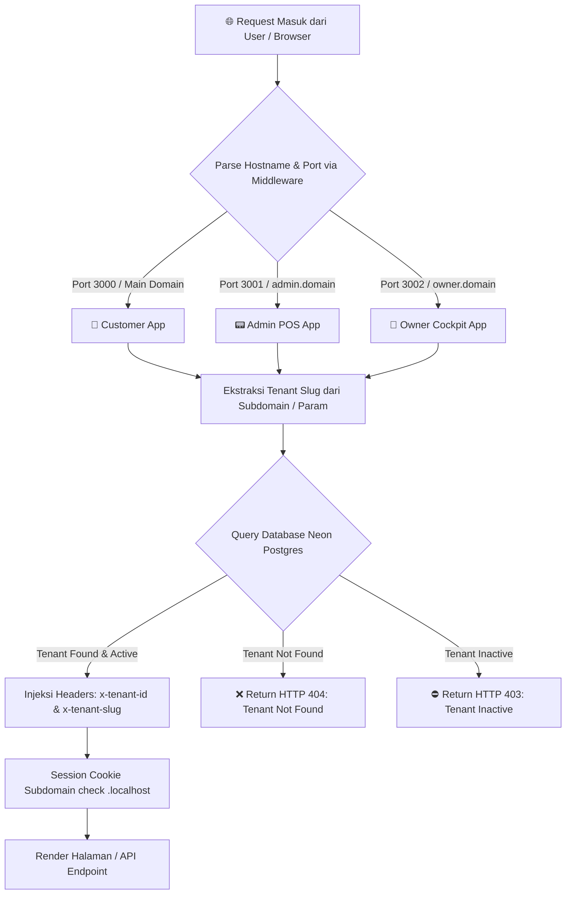
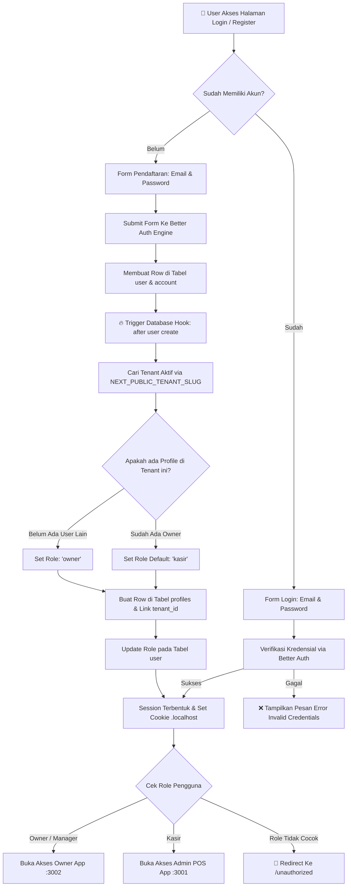
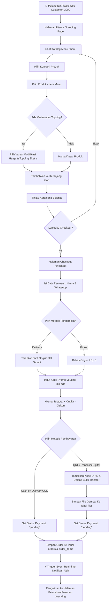
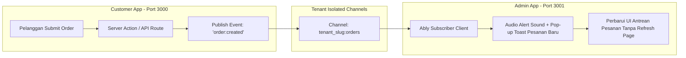
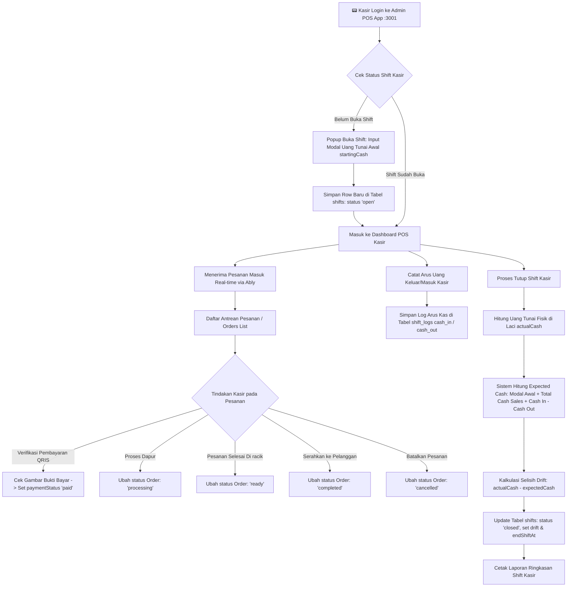
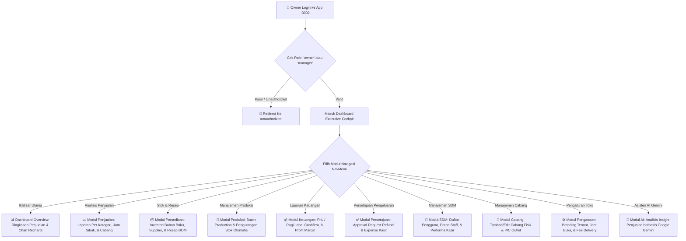
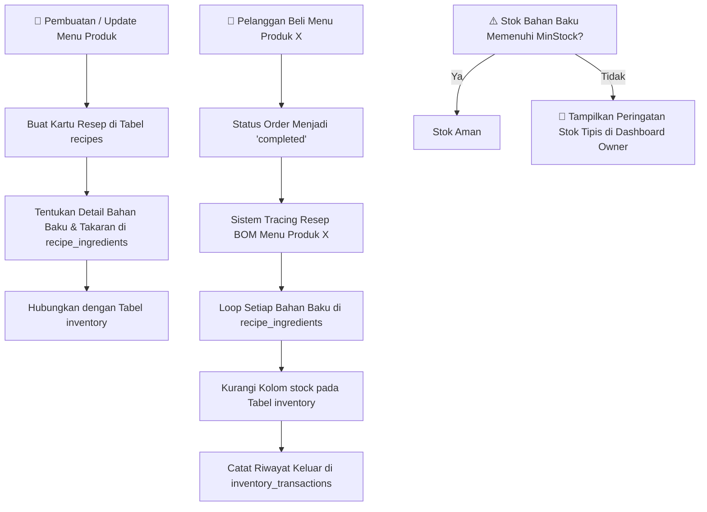
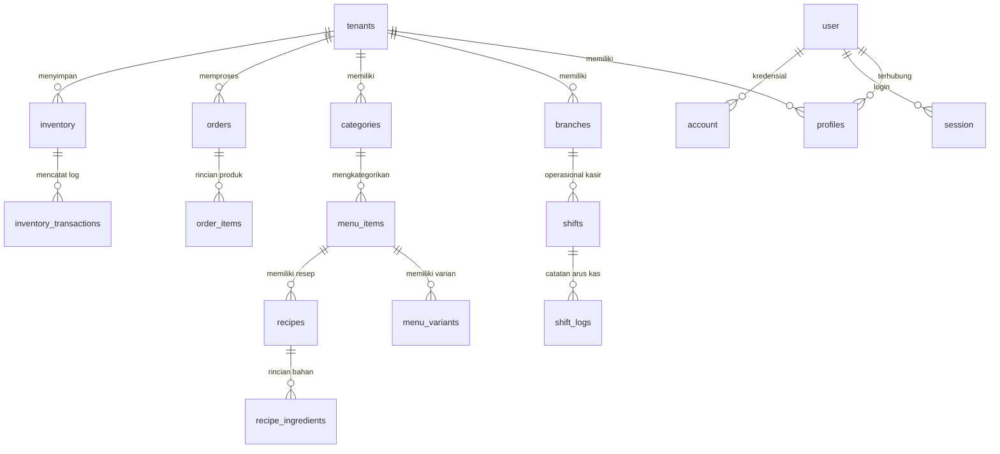
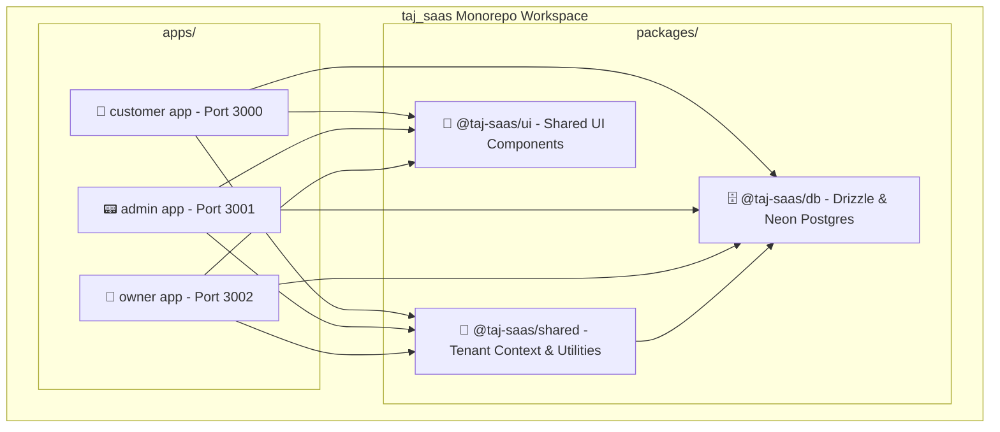

# 🗺️ Dokumentasi Flowchart Complete - Taj SaaS Platform

Dokumen ini berisi diagram alur (flowchart) lengkap dan terstruktur untuk sistem **Taj SaaS (Enterprise Multi-Tenant F&B SaaS Platform)**. Seluruh diagram dibuat menggunakan standar **Mermaid** untuk mempermudah visualisasi arsitektur, navigasi routing, otentikasi, transaksi pelanggan, notifikasi real-time, operasional kasir (POS), dan modul eksekutif (Owner Cockpit).

---

## 📑 Daftar Isi Flowchart
1. [Arsitektur Global & Routing Multi-Tenant](#1-arsitektur-global--routing-multi-tenant)
2. [Alur Otentikasi & Autorisasi Pengguna (Better Auth & RBAC)](#2-alur-otentikasi--autorisasi-pengguna-better-auth--rbac)
3. [Alur Pelanggan: Dari Menu Hingga Pembayaran (Customer App Journey)](#3-alur-pelanggan-dari-menu-hingga-pembayaran-customer-app-journey)
4. [Alur Notifikasi Real-time Pesanan (Ably Pub/Sub)](#4-alur-notifikasi-real-time-pesanan-ably-pubsub)
5. [Alur Operasional POS Kasir & Shift (Admin App)](#5-alur-operasional-pos-kasir--shift-admin-app)
6. [Alur Executive Cockpit & Manajemen Bisnis (Owner App)](#6-alur-executive-cockpit--manajemen-bisnis-owner-app)
7. [Alur Manajemen Inventori, Resep BOM, & Produksi](#7-alur-manajemen-inventori-resep-bom--produksi)
8. [Diagram Relasi Data & Entitas Utama (Database Flow ERD)](#8-diagram-relasi-data--entitas-utama-database-flow-erd)
9. [Grafik Dependensi Monorepo & Package Dependencies](#9-grafik-dependensi-monorepo--package-dependencies)

---

## 1. Arsitektur Global & Routing Multi-Tenant

Diagram ini menjelaskan bagaimana `Next.js Middleware` menangkap request HTTP, melakukan ekstraksi tenant slug dari hostname/port, dan meneruskannya ke aplikasi yang sesuai dengan menyertakan header `x-tenant-id` & `x-tenant-slug`.

---

## 2. Alur Otentikasi & Autorisasi Pengguna (Better Auth & RBAC)

Diagram ini menggambarkan alur Pendaftaran/Login pengguna, eksekusi **Database Hook** untuk membuat profil tenant secara otomatis, dan pemeriksaan Role-Based Access Control (RBAC).

---

## 3. Alur Pelanggan: Dari Menu Hingga Pembayaran (Customer App Journey)

Diagram ini mengalirkan seluruh perjalanan pelanggan dari melihat katalog menu, memilih varian & topping, memasukkan ke keranjang, checkout dengan promo, hingga mengunggah bukti bayar QRIS.

---

## 4. Alur Notifikasi Real-time Pesanan (Ably Pub/Sub)

Diagram ini menjelaskan komunikasi asinkron berkecepatan tinggi antara aplikasi Pelanggan dan Kasir POS menggunakan **Ably Channel**.

---

## 5. Alur Operasional POS Kasir & Shift (Admin App)

Diagram ini mencakup alur lengkap kerja kasir harian: Pembukaan Shift (Modal Awal), Pengelolaan Antrean Pesanan Masuk, Pencatatan Arus Kas, dan Penutupan Shift (Rekonsiliasi Cash Drift).

---

## 6. Alur Executive Cockpit & Manajemen Bisnis (Owner App)

Diagram ini menjelaskan kontrol manajemen tingkat tinggi oleh Pemilik Bisnis (Owner) untuk memantau performa 11 modul utama.

---

## 7. Alur Manajemen Inventori, Resep BOM, & Produksi

Diagram ini mendetailkan keterkaitan antara Resep Produk (**Bill of Materials**), pengurangan stok bahan baku saat pesanan dibuat, dan pemotongan stok otomatis saat produksi.

---

## 8. Diagram Relasi Data & Entitas Utama (Database Flow ERD)

Diagram ini memperlihatkan struktur ERD 23 tabel utama pada Neon Postgres yang terikat oleh arsitektur **Multi-Tenant Data Isolation**.

---

## 9. Grafik Dependensi Monorepo & Package Dependencies

Diagram ini memperlihatkan struktur monorepo Turborepo + pnpm workspaces dan bagaimana paket-paket saling berbagi logic.

---

*Dokumentasi flowchart ini dibuat secara otomatis dan komprehensif untuk proyek Taj SaaS Platform.*
